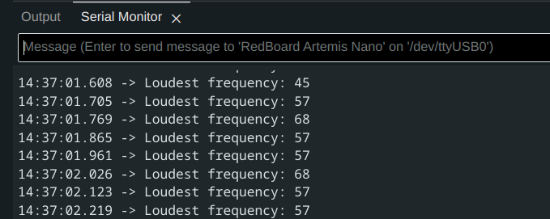
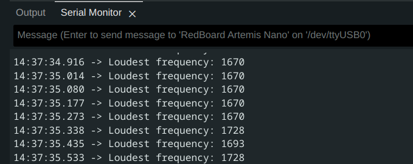
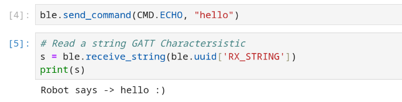
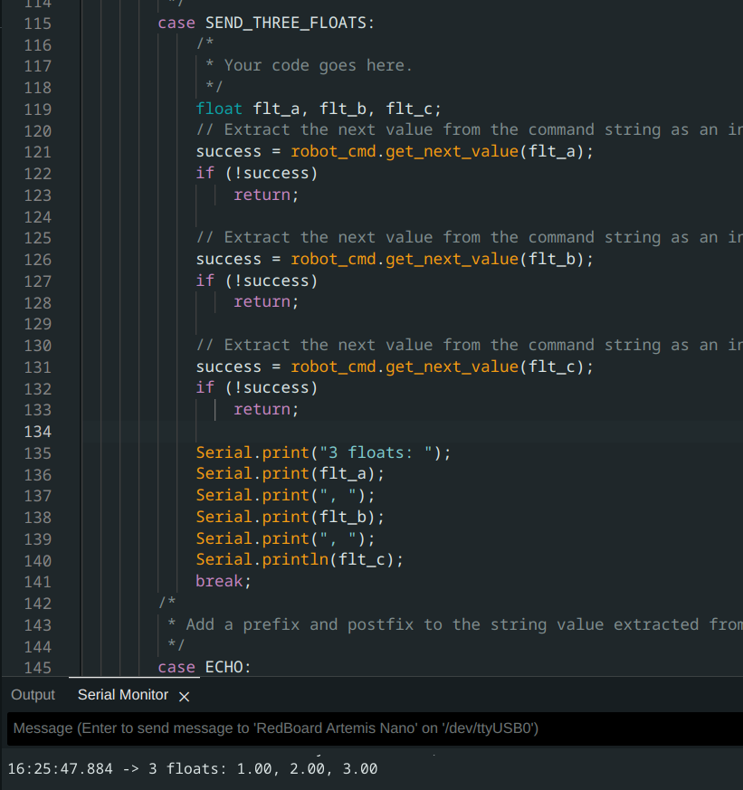
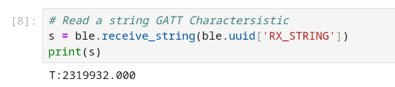
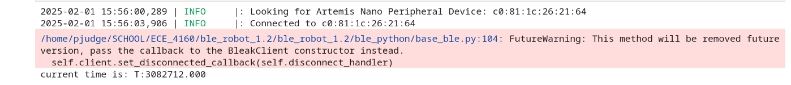
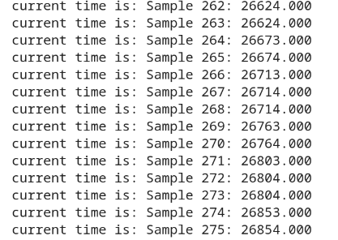
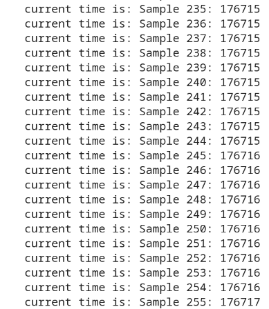
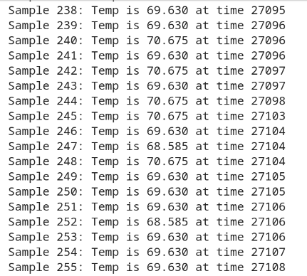

* [Main](index.md)

# Lab 1: Artemis Board and Bluetooth

This lab was divided into 2 parts over to course of two weeks to help us familiarize ourselves with the use of the Arduino IDE and Artemis board before learning how to work with the Artemis board over a bluetooth connection with a computer. 

## LAB 1A

### Prelab

The Prelab for the first part of the lab was simply to download and install the most recent version of the [Arduino IDE](https://www.arduino.cc/en/software), and then to install the apollo3 libary from sparkfun by adding it to the libary manager using the json link found [here].

### Lab

The bulk of Lab 1A was testing our ability to use the Arduino IDE to flash code to our Artemis board and run it. There were 4 example programs that were run to verify the functionality of  specific parts of the board. These example programs would also be used in the future as a reference for what functions can be used to read data from and control various sensors.

### 1. Blinky

As is always the case when testing a new microcontroller board, the first test run was to blink a single LED. The "Blinky" example code was taken from the built-in-examples section of the Arduino IDE


### 2. Serial Monitor

To test the functionality of the serial communication capabilities, I used the Example4_Serial code found in the Apollo3 library's example section. This demo simply had the Artemis board recieve a serial commuications message in the form of a string, and then send back that same string in a second serial commication, causing a sort of echo.

In this example, the computer sends the message "hello world", through the serial monitor, and the message "hello world" is repeated back.

#### Computer sends serial message:


#### Artemis recieves and replys via serial message:


### 3. Temperature Sensor

To test the temperature sensor, I used the Example2_analogread code found in the Apollo3 library's examples. This demo would read the data from the temperature sensor and send it to the computer over serial communication. 

To verify the temperature sensor was working, I looked at the background temperature readings and then held my finger over the board for a few seconds to warm it up.
#### Background Temperature:


#### Hand Temperature:

Over the course of about 4 seconds, the temperature went from 32924 units to 33088 units, proving my hand did warm up the sensor.

### 4. Microphone
To test the microphone, I used the Example1_microphone code found in the PDM library's examples. This demo would read the frequency data from the microphone and send it to the computer over serial communication. 

Initially, when no overt sounds were being made, the microphone read the background frequency of the room to be between 50-60 hz. 

#### Background Frequency:


However, when I held the Artemis up and whistled into it, the loudest recorded frequency changed to around 1670 hz, confirming the microphone works.
#### Whistling Frequency:



## LAB 1B

### Prelab
The first part of the prelab was to set up a virtual environment so that we use jupyter notebook to write the commands to send to the Artemis

### Python Installation
I already had a python installation on my machine, so I simply verified I was on the most recent version.

### Virtual Environment
Following the instructions in the prelab, I created a new virtual environment by running the commands 
```
python3 -m pip install --user virtualenv
```
```
python3 -m venv FastRobots_ble
```
in a terminal.

I could then activate the virtual environment by running the command
```
source FastRobots_ble/bin/activate
```
Once the virtual environment was activated, I then installed the required python packages by running the command 
```
pip install numpy pyyaml colorama nest_asyncio bleak jupyterlab
```

### Codebase
The codebase was downloaded from [here](https://fastrobotscornell.github.io/FastRobots-2025/labs/ble_robot_1.2.zip), and extracted into the same folder as the virtual environment.

I then started jupyter lab by running 
```
jupyter lab
```

### Configuration

To connect my computer to the Artemis board over bluetooth, I needed to know the artemis board's MAC address, I did this by burning the ``ble_arduino.ino`` program from the codebase onto the board. This would print the board's MAC address over serial.

#### MAC Address and UUID:

For some reason, the serial monitor did not register until I added an extra ``serial.print()`` statement right under ``serial.begin()``, which is why there is a "hi" printed above the MAC address.

I also generated a Unique Universal Identifier (UUID) in a terminal window to ensure I would only connect to my board and not another student's.

Once I had these two addresses, added them in the correct spots in both the jupyter lab file ``connections.yaml``, and the BLE_UUIDs section in ``ble_arduino.ino``

##### Connections.yaml:
```
artemis_address: 'c0:81:1c:26:21:64'

ble_service: 'fc457481-eb77-45bf-8ae5-ebad49aa0dce'

characteristics:
  TX_CMD_STRING: '9750f60b-9c9c-4158-b620-02ec9521cd99'

  RX_FLOAT: '27616294-3063-4ecc-b60b-3470ddef2938'
  RX_STRING: 'f235a225-6735-4d73-94cb-ee5dfce9ba83'
```

##### BLE_UUIDs:
```
//////////// BLE UUIDs ////////////
#define BLE_UUID_TEST_SERVICE "fc457481-eb77-45bf-8ae5-ebad49aa0dce"

#define BLE_UUID_RX_STRING "9750f60b-9c9c-4158-b620-02ec9521cd99"

#define BLE_UUID_TX_FLOAT "27616294-3063-4ecc-b60b-3470ddef2938"
#define BLE_UUID_TX_STRING "f235a225-6735-4d73-94cb-ee5dfce9ba83"
//////////// BLE UUIDs ////////////
```
### Tasks

#### ECHO

The funtion ``ECHO`` is designed to allow the Artemis board to receive a string sent from the computer over bluetooth and send back a string over bluetooth. It is important for the board to be both able to send and recieve data. 

The function on the arduino side was written by modifying the given ``PING`` function to send the recived data back instead of just the message "pong".
```
case ECHO:

            char char_arr[MAX_MSG_SIZE];

            // Extract the next value from the command string as a character array
            success = robot_cmd.get_next_value(char_arr);
            if (!success)
                return;

            /*
             * Your code goes here.
             */
            Serial.print("Robot says -> ");
            Serial.print(char_arr);
            Serial.println(" :)");
            
            tx_estring_value.clear();
            tx_estring_value.append("Robot says -> ");
            tx_estring_value.append(char_arr);
            tx_estring_value.append(" :)");
            tx_characteristic_string.writeValue(tx_estring_value.c_str());

            Serial.print("Sent back: ");
            Serial.println(tx_estring_value.c_str());

            break;
```

On the jupyter lab side, sending the command and receiving the reply looks like this:


#### SEND_THREE_FLOATS

This funtion is a modification of the given command ``SEND_TWO_INTS``, and was accomplished by simply adding an extra sent and recieve value, and changing the value's type to ``float``. 

On the jupyter lab side it looks like this:


And on the arduino side it looks like this:


#### GET_TIME_MILLIS

Another important function for the board is to be able to send timestamps along side data. The ``GET_TIME_MILLIS`` function uses function ``millis()`` to access the onboard timer and send the current timestamp in a string, using similar code to the ``ECHO`` command.

On the arduino side:
```
case GET_TIME_MILLIS:
          float time_millis;
          time_millis = (float) millis();

          Serial.print("T:");
          Serial.println(time_millis);

          tx_estring_value.clear();
          tx_estring_value.append("T:");
          tx_estring_value.append(time_millis);
          tx_characteristic_string.writeValue(tx_estring_value.c_str());

          break;

          case TIME_DATA_LOOP:
            {
            int count = 0;
            unsigned long startT = millis();
            while (millis() - startT < 5000) {
                
                tx_estring_value.clear();
                tx_estring_value.append("Sample ");
                tx_estring_value.append(count);
                tx_estring_value.append(": ");
                tx_estring_value.append((float) millis());
                tx_characteristic_string.writeValue(tx_estring_value.c_str());
                count++;

            }

            Serial.println("Sent time many times");

            break;
```

In jupyter lab:


#### Notification Handler

The nofification handler is a function that is designed to work with the ``ble.start_notify`` function. The ``ble.start_notify`` function will call the notification handler every time a string message is recieved from the Artemis over bluetooth. At this stage of the lab, I created a very simple notification handler which would simply print out the string recived. Using the notification handler alongside ``ble.start_notify`` removes the need to call the ``ble.receive_string`` command in jupyter notebook every time we want to recieve a string. 

The notification handler for this stage of the lab is this:
```
def notif_handler(uuid, bytes):
    a = ble.bytearray_to_string(bytes)
    print(f'current time is: {a}')
    
```

For reasons unkown to science, the notification handler only printed the messages under this cell:


#### Looped GET_TIME_MILLIS

In order to get a baseline for how fast the Artemis board can send data, I created a loop to repeatedly run the code for ``GET_TIME_MILLIS`` for a period of around 5 seconds. 

Artemis Board:
```
case TIME_DATA_LOOP:
            {
            int count = 0;
            unsigned long startT = millis();
            while (millis() - startT < 5000) {
                
                tx_estring_value.clear();
                tx_estring_value.append("Sample ");
                tx_estring_value.append(count);
                tx_estring_value.append(": ");
                tx_estring_value.append((float) millis());
                tx_characteristic_string.writeValue(tx_estring_value.c_str());
                count++;

            }

            Serial.println("Sent Data");

            break;
            }
```

Jupyter lab:
```
ble.send_command(CMD.TIME_DATA_LOOP, "")
```
This function managed to send 275 samples over a period of 4.971 seconds, meaning it had a data rate of around 55 messages a second



#### SEND_TIME_DATA

The function ``SEND_TIME_DATA`` first stores a list of timestamps in an array of length 256, and then loops through the array and sends all the entries as fast as it can. This is a different method used than in ``TIME_DATA_LOOP``, since the data is not being sent in "real_time", but is instead being collected and then sent in seperate loops. The fact that a message does not have to be sent between each timestamp should significantly improve the frequency of the timestamps, and the fact that the messages don't have to wait for a timestamp in between them should increase the frequency of the messages.


Artemis Board:
```
case SEND_TIME_DATA:
          {
          int i = 0;
          unsigned long startT = millis();

          while (i < data_array_size) {
              
              time_data[i] = (int) millis();
              i++;

              if(i == data_array_size-1)
              Serial.println("OoM");
              
          }
          for (int j = 0; j < data_array_size; j++) {

              if(time_data[j] == 0)
              break;

              tx_estring_value.clear();
              tx_estring_value.append("Sample ");
              tx_estring_value.append(j);
              tx_estring_value.append(": ");
              tx_estring_value.append(time_data[j]);
              tx_characteristic_string.writeValue(tx_estring_value.c_str());

          }

          Serial.println("Sent data");

          break;
          }
```

The ``time_data`` array was created as a global variable at the top of the file:
```
const int data_array_size = 256;
int time_data[data_array_size];
```
Jupyter Lab:
```
ble.send_command(CMD.SEND_TIME_DATA, "")
```


This function was able to send 256 timestamps that ranged from 176717ms to 176683ms. The means it has the ability to store timestamp data at almost 7530 messages per second, as long as it sends that data asynchronously. 

#### GET_TEMP_READINGS

This function is almost identical to ``SEND_TIME_DATA``, with the only difference being that an array of temperature values is also being recorded and sent alongside the timestamps.

Artemis Board:
```
case GET_TEMP_READINGS:
          {
          int i = 0;
          unsigned long startT = millis();

          //Build the Array
          while ( i < data_array_size) {
              
              time_data[i] = (int) millis();
              temp_data[i] = getTempDegF();
              i++;

              if(i == data_array_size-1)
              Serial.println("OoM");
              
          }
          for (int j = 0; j < data_array_size; j++) {

              if(time_data[j] == 0)
              break;

              tx_estring_value.clear();
              tx_estring_value.append("Sample ");
              tx_estring_value.append(j);
              tx_estring_value.append(": Temp is ");
              tx_estring_value.append(temp_data[j]);
              tx_estring_value.append(" at time ");
              tx_estring_value.append(time_data[j]);
              tx_characteristic_string.writeValue(tx_estring_value.c_str());

          }

          Serial.println("Sent time many times");

          break;
          }
```
The ``temp_data`` array was created as a global variable at the top of the file:
```
int temp_data[data_array_size];
```
Jupyter Lab
```
ble.send_command(CMD.GET_TEMP_READINGS, "")
```


This was able to store 256 samples over the course 213 ms, giving a store rate of 1201 messages per second.
