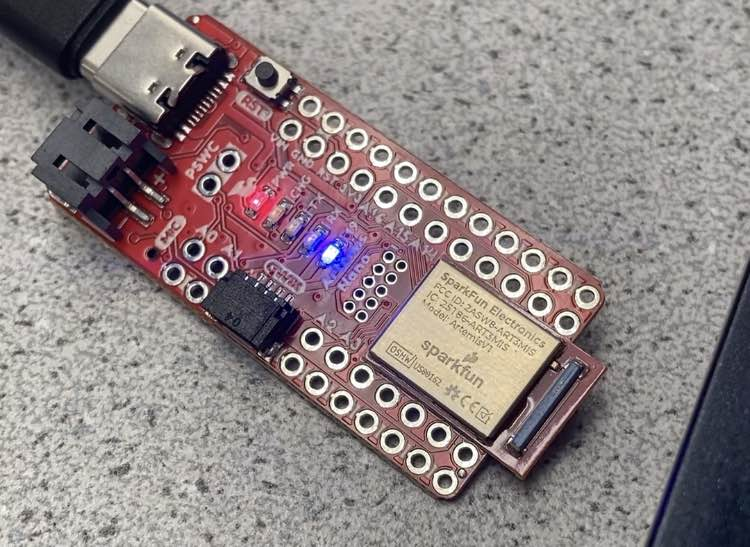
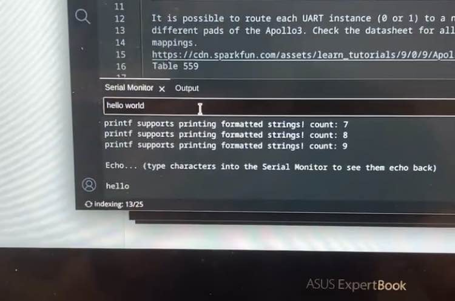
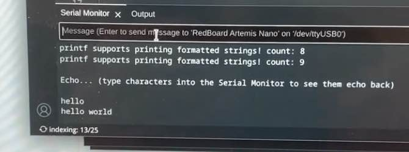
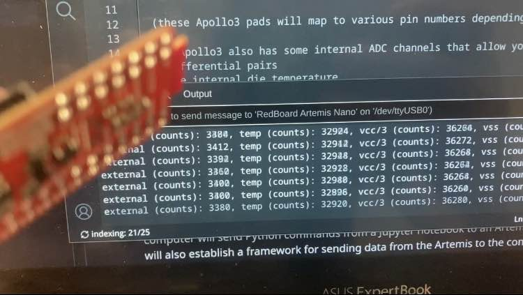
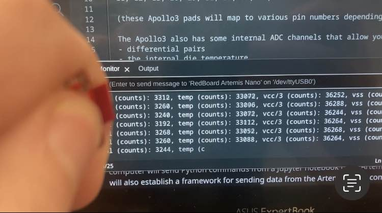

* [Main](index.md)

# Lab 1: Artemis Board and Bluetooth

This lab was divided into 2 parts over to course of two weeks to help us familiarize ourselves with the use of the Arduino IDE and Artemis board before learning how to work with the Artemis board over a bluetooth connection with a computer. 

## LAB 1A

### Prelab

The Prelab for the first part of the lab was simply to download and install the most recent version of the [Arduino IDE](https://www.arduino.cc/en/software), and then to install the apollo3 libary from sparkfun by adding it to the libary manager using the json link found [here].

### Lab

The bulk of Lab 1A was testing our ability to use the Arduino IDE to flash code to our Artemis board and run it. There were 4 example programs that were run to verify the functionality of  specific parts of the board. These example programs would also be used in the future as a reference for what functions can be used to read data from and control various sensors.

### 1. Blinky

As is always the case when testing a new microcontroller board, the first test run was to blink a single LED. The "Blinky" example code was taken from the built-in-examples section of the Arduino IDE




### 2. Serial Monitor

To test the functionality of the serial communication capabilities, I used the Example4_Serial code found in the Apollo3 library's example section. This demo simply had the Artemis board recieve a serial commuications message in the form of a string, and then send back that same string in a second serial commication, causing a sort of echo.

In this example, the computer sends the message "hello world", through the serial monitor, and the message "hello world" is repeated back.

#### Computer sends serial message:


#### Artemis recieves and replys via serial message:


### 3. Temperature Sensor

To test the temperature sensor, I used the Example2_analogread code found in the Apollo3 library's examples. This demo would read the data from the temperature sensor and send it to the computer over serial communication. 

To verify the temperature sensor was working, I looked at the background temperature readings and then held my finger over the board for a few seconds to warm it up.
#### Background Temperature:


#### Hand Temperature:

Over the course of about 4 seconds, the temperature went from 32924 units to 33088 units, proving my hand did warm up the sensor.

### 4. Microphone
To test the microphone, I used the Example1_microphone code found in the PDM library's examples. This demo would read the frequency data from the microphone and send it to the computer over serial communication. 

Initially, when no overt sounds were being made, the microphone read the background frequency of the room to be between 50-60 hz. 

#### Background Frequency:


However, when I held the Artemis up and whistled into it, the loudest recorded frequency changed to around 1670 hz, confirming the microphone works.
#### Whistling Frequency:


## LAB 1B

### Prelab
The first part of the prelab was to set up a virtual environment so that we use jupyter notebook to write the commands to send to the Artemis

#### Python Installation
I already had a python installation on my machine, so I simply verified I was on the most recent version.

#### Virtual Environment
Following the instructions in the prelab, I created a new virtual environment by running the commands 
```
python3 -m pip install --user virtualenv
```
```
python3 -m venv FastRobots_ble
```
in a terminal.

I could then activate the virtual environment by running the command
```
source FastRobots_ble/bin/activate
```
Once the virtual environment was activated, I then installed the required python packages by running the command 
```
pip install numpy pyyaml colorama nest_asyncio bleak jupyterlab
```

#### Codebase
The codebase was downloaded from [here](https://fastrobotscornell.github.io/FastRobots-2025/labs/ble_robot_1.2.zip), and extracted into the same folder as the virtual environment.

I then started jupyter lab by running 
```
jupyter lab
```