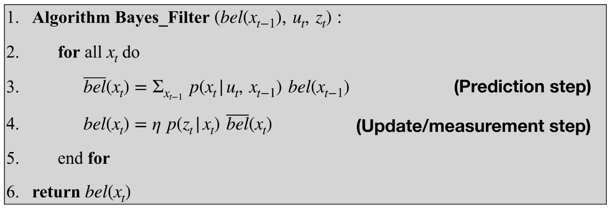
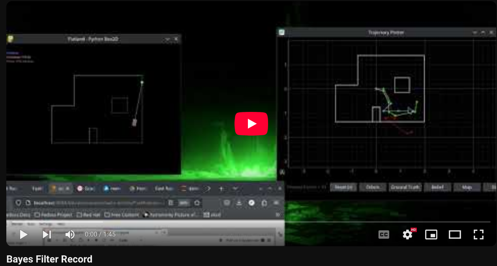
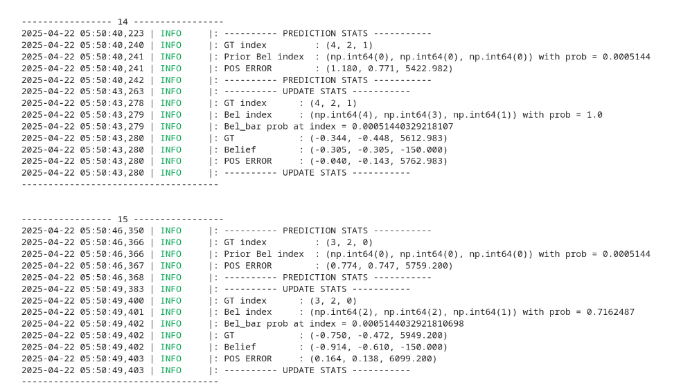

* [Main](index.md)

# Lab 10: Bayes Filter Simulation

In this lab, the a Bayes filter was used to localize a simulated robot.

# Bayes filter

The Bayes filter is a tool for localizing a robot that takes in a prior belief about a robot's state, a control input and a measurement input. THe control input is used to predict the new state of the robot, which is then corrected by the measurement data, creating a new belief about the robot's state.



# Compute control

This function approximates the control inputs needed to change the robot's pose (x position ,y position, and angle) from one pose to another. Since all robot movements can be modeled as a rototion to a new angle followed by a translation by some distance, followed by a second rotation to a new angle, this function returns those parameters as what can be used as the control input, u_t, in the bayes filter.

```python
def compute_control(cur_pose, prev_pose):
    """ Given the current and previous odometry poses, this function extracts
    the control information based on the odometry motion model.

    Args:
        cur_pose  ([Pose]): Current Pose
        prev_pose ([Pose]): Previous Pose 

    Returns:
        [delta_rot_1]: Rotation 1  (degrees)
        [delta_trans]: Translation (meters)
        [delta_rot_2]: Rotation 2  (degrees)
    """
    cur_x = cur_pose[0]
    cur_y = cur_pose[1]
    cur_yaw = cur_pose[2] * math.pi/180
    prev_x = prev_pose[0]
    prev_y = prev_pose[1]
    prev_yaw = prev_pose[2] *math.pi/180

    delta_trans = np.linalg.norm([cur_x-prev_x, cur_y-prev_y])

    theta = math.atan2((cur_x-prev_x), (cur_y-prev_y))

    delta_rot_1 = (theta - prev_yaw)*180/math.pi
    delta_rot_2 = (cur_yaw - theta)*180/math.pi

    
    return delta_rot_1, delta_trans, delta_rot_2
```

# Odometry motion model

The first step of the Bayes filter is to predict where the robot is now based off of the control input and Odometry model. This function takes in a control input u, the previous pose, and the current pose, and calculates the probability of the current pose being the pose reached by that control input. It does this by calculating the actual control input needed to make the change in pose and then using a gaussian function to approximate the probability of the difference in control inputs.

```python
def odom_motion_model(cur_pose, prev_pose, u):
    """ Odometry Motion Model

    Args:
        cur_pose  ([Pose]): Current Pose
        prev_pose ([Pose]): Previous Pose
        (rot1, trans, rot2) (float, float, float): A tuple with control data in the format 
        format (rot1, trans, rot2) with units (degrees, meters, degrees)


    Returns:
        prob [float]: Probability p(x'|x, u)
    """

    u_delta_rot1 = mapper.normalize_angle(u[0])
    u_delta_rot2 = mapper.normalize_angle(u[2])
    u_delta_trans = u[1]

    actual_u = compute_control(cur_pose, prev_pose)
    actual_delta_rot1 = mapper.normalize_angle(actual_u[0])
    actual_delta_rot2 = mapper.normalize_angle(actual_u[2])
    actual_delta_trans = actual_u[1]

    p1 = loc.gaussian(actual_delta_rot1, u_delta_rot1, loc.odom_rot_sigma)
    p2 = loc.gaussian(actual_delta_trans, u_delta_trans, loc.odom_trans_sigma)
    p3 = loc.gaussian(actual_delta_rot2, u_delta_rot2, loc.odom_rot_sigma)

    prob = p1*p2*p3

    return prob

```

# Prediction Step

The prediction step uses the odometry model to update the probability that the robot is has a given state to take into account the control input. The function loops through every discretetized state x_{t-1} in the grid, and then updates the likelihood that every other possible state is now the true state, x_t, given the control input of this step. This is the most computationally intensive step of the bayes filter as every grid space needs to update every other grid space, making a finer grid extremely expensive in computation time.
```python
def prediction_step(cur_odom, prev_odom):
    """ Prediction step of the Bayes Filter.
    Update the probabilities in loc.bel_bar based on loc.bel from the previous time step and the odometry motion model.

    Args:
        cur_odom  ([Pose]): Current Pose
        prev_odom ([Pose]): Previous Pose
    """
    u = compute_control(cur_odom, prev_odom)

    cells_X, cells_Y, cells_A = mapper.MAX_CELLS_X, mapper.MAX_CELLS_Y, mapper.MAX_CELLS_A
    temp = np.zeros((cells_X, cells_Y, cells_A))

    for i in range(cells_X):
        for j in range(cells_Y):
            for k in range(cells_A):
                if(loc.bel[i,j,k] > .0001):
                    for a in range(cells_X):
                        for b in range(cells_Y):
                            for c in range(cells_A):
                                cur_pose = mapper.from_map(a,b,c)
                                prev_pose = mapper.from_map(i,j,k)
                                prob = odom_motion_model(cur_pose, prev_pose, u)
                                belief = loc.bel[i,j,k]
                                temp += prob * belief

    sum_val = np.sum(temp)
    loc.bel_bar = np.true_divide(temp, sum_val)
```

# Sensor model

The sensor model is used in the update step of the bayes filter. It takes in the most recent measurements (18 depth measurements the robot collects while spinning in a circle) of the robot and calculates the probability of the measurements being true given the current pose of the robot, using a gaussian funtion.

```python
def sensor_model(obs):
    """ This is the equivalent of p(z|x).


    Args:
        obs ([ndarray]): A 1D array consisting of the true observations for a specific robot pose in the map 

    Returns:
        [ndarray]: Returns a 1D array of size 18 (=loc.OBS_PER_CELL) with the likelihoods of each individual sensor measurement
    """
    prob_array = []
    
    for i in range(18):
        
        gauss = loc.gaussian(loc.obs_range_data[i], obs[i], loc.sensor_sigma)
        prob_array.append(gauss)

    return prob_array
```

# Update step

The update step loops through all the possible states the robot could be in and updates their probability of being true given the probability of the measurement data being true given that state. The probabilities of each possible state are then normalized and this collection of probabilities is the new belief of the robot.

```python
def update_step():
    """ Update step of the Bayes Filter.
    Update the probabilities in loc.bel based on loc.bel_bar and the sensor model.
    """
    cells_X, cells_Y, cells_A = mapper.MAX_CELLS_X, mapper.MAX_CELLS_Y, mapper.MAX_CELLS_A

    for i in range(cells_X):
        for j in range(cells_Y):
            for k in range(cells_A):
                p = sensor_model(mapper.get_views(i,j,k))
                prob = np.prod(p)
                loc.bel[i,j,k] = loc.bel_bar[i,j,k] * prob

    loc.bel = loc.bel / np.sum(loc.bel)
```

# Running the simulator

Once all the components of the Bayes filter were finished, I ran the simulator and plotted the dead reckoned odometry data, the true location of the robot, and the Bayes Filter's belief in the location of the robot.

[](https://youtu.be/x5594mKrvWg)

The dead reckoned odometry data in red is extremely inaccurate, as is to be expected. The belief data in blue however, is quite close to the true pose in green. This means that the update step did a good job of correcting the predicted state from the odometry.



As can be seen from these printouts, the predict step has reduces the confidnece (prob) to an extremly low value. However, the update step increases that confidence to almost 100%.