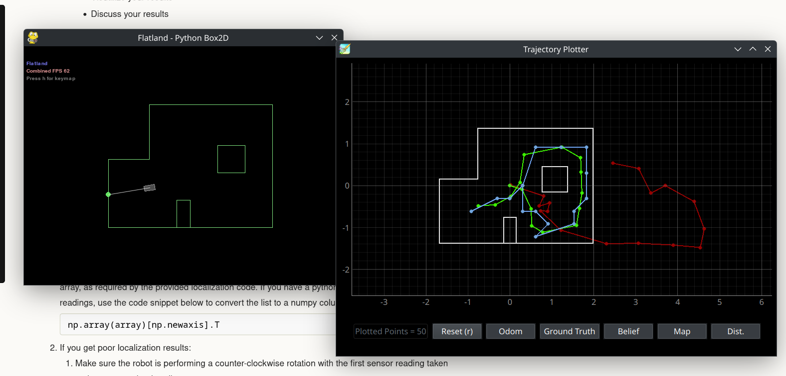
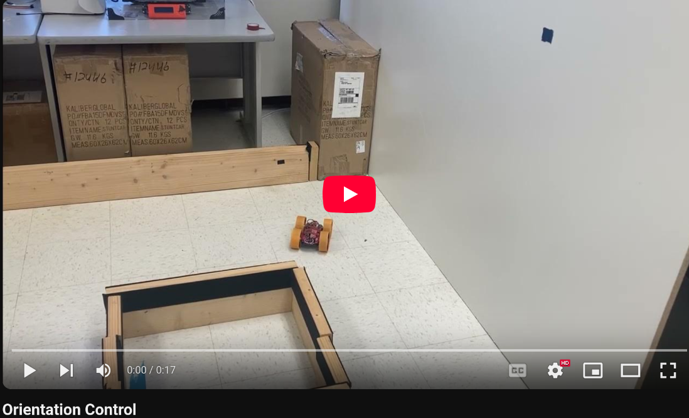
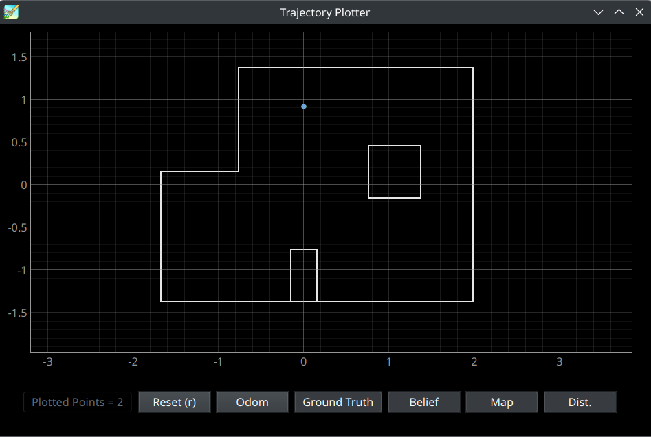
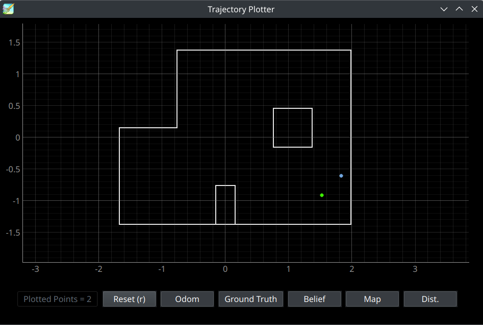
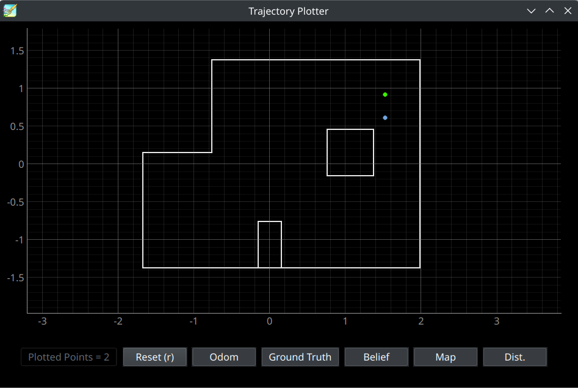
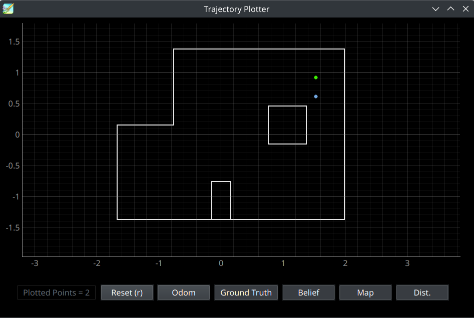
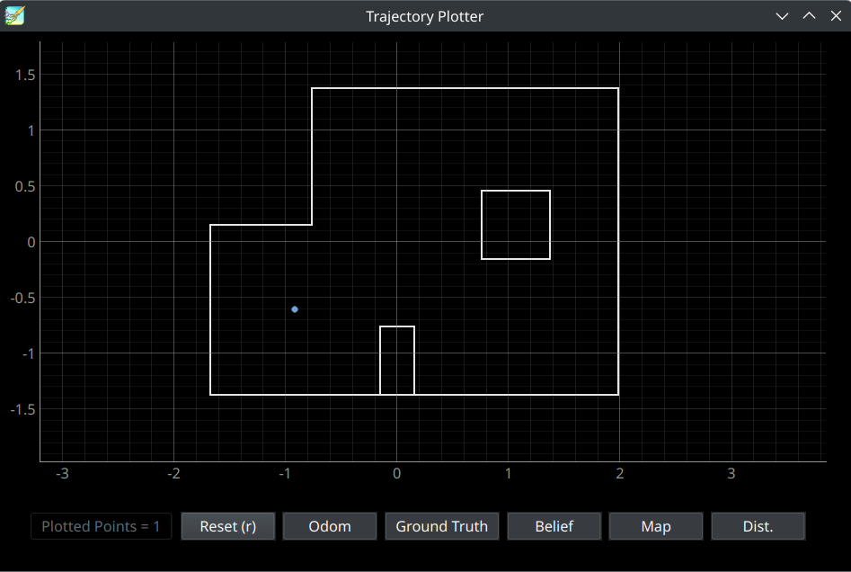
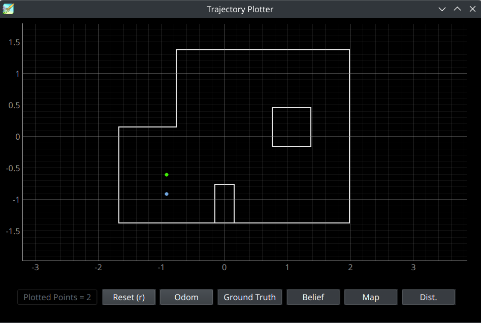

* [Main](index.md)

# Lab 11: Bayes Filter

This lab used a similar Bayes filter to the one implemented in [Lab 10](lab10.md) with real ToF data from the physical robot to localize.

## Prelab

The Bayes filter being used in this was provided by the course to ensure optimality. THe firts step of the lab was to run a simulation that localized using this filter to ensure it worked properly. The results of this simulation are shown below:



The results of the simulation were as expected.

## Lab Tasks

### Implementing the Observation Loop function

The given Bayes filter expected 18 depth measurements, each spaced 20 degrees apart. To provide it with this, I used a modified version of my mapping code from [Lab 9](lab9.md). In lab 9, the robot took one depth measurement every 10 degrees, and turned for 1 minute of execution time. This was easily altered to take 18 measurements 20 degrees apart.

The ``perform_observation_loop`` function first starts a notification handler to collect data the robot sends over bluetooth. It then issues a bluetooth command to run the modifiec Lab 9 code, which causes the robot to turn 360 degrees and collect depth measuremnts every 20 degrees. The function then waits for all 18 depth measurments to be received before stopping the notification handler, storing the depth measurements in numpy arrays, and converting them from millimeters to meters.


```python
 async def perform_observation_loop(self, rot_vel=120):
        """Perform the observation loop behavior on the real robot, where the robot does  
        a 360 degree turn in place while collecting equidistant (in the angular space) sensor
        readings, with the first sensor reading taken at the robot's current heading. 
        The number of sensor readings depends on "observations_count"(=18) defined in world.yaml.
        
        Keyword arguments:
            rot_vel -- (Optional) Angular Velocity for loop (degrees/second)
                        Do not remove this parameter from the function definition, even if you don't use it.
        Returns:
            sensor_ranges   -- A column numpy array of the range values (meters)
            sensor_bearings -- A column numpy array of the bearings at which the sensor readings were taken (degrees)
                               The bearing values are not used in the Localization module, so you may return a empty numpy array
        """
        #start notification handler
        ble.start_notify(ble.uuid['RX_STRING'], notif_handler)

        ble.send_command(CMD.PID_TURN, "")
        print("send command fin")

        #wait for data to be sent over bluetooth
        while(len(distance_data_map) < 18):
            await asyncio.sleep(1)

        #stop notification handler
        ble.stop_notify(ble.uuid['RX_STRING'])
        sensor_ranges = np.array(distance_data_map)[np.newaxis].T
        sensor_ranges = sensor_ranges/1000.0
        sensor_bearings = np.array(yaw_data_map)[np.newaxis].T

        return sensor_ranges, sensor_bearings
```
```python
def notif_handler(uuid, bytes):
    s = ble.bytearray_to_string(bytes)
    if("|" in s):
        sep_notif = s.split("|")
        distance_data_map.append(float(sep_notif[0]))
        yaw_data_map.append(float(sep_notif[1]))
```

The robot turning in place looked much the same as in [Lab 9](lab9.md), save for turing 20 degrees rather than 10.
[](https://youtu.be/83PK977OZJ0)

## Localization Results
The Bayes filter was run with the robot collecting data at the points:

    (0, 3)
    (5, -3)
    (5, 3)
    (-2, -3)

All starting orientations were 0 degrees, facing the far right side of the map.

The Bayes filter was run twice at each point.

#### (0,3)




Both times the filter was run at (0,3), the robot localized to the exact spot it was actually at. I believe this could be because the point (0,3) has an especially unique view of the map, being able to look at both the square and rectangle features of the map.

#### (5,-3)



For both runs at (5,-3), the robot (blue) localized to the same spot close to, but not exactly at the correct point (plotted in green). The fact that both runs localized to the exact same point, which was notably closer to the wall than the robot actually was, could mean that the depth measurements of that wall were off, potentially due to dirt, placement, or lighting issues.

#### (5,3)




Again, both runs localized to the same point close to, but not exactly on, the correct point. Since both of the points at x=5 caused this consistent error, it could be because they look extremely similar from the robots perpsective. In both spots, the robot would mostly just see a corner and a square, and that lack of unique identifiers for either spot could cause the filter to be less accurate.

#### (-3,-2)




This point was the only point where the robot localized perfectly in one run, and imperfectly in another. The perfect localization could have a similar cause to the localization at (0,3). This point is the only point in the map surrounded almost completely by walls. I would assign blame for the imperfect run on the robot perhaps slipping in its turns more than was expected.