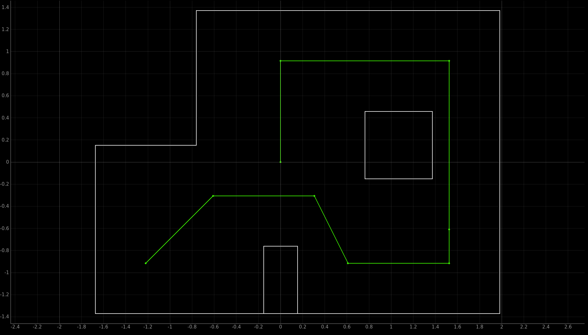

* [Main](index.md)

This lab was done in collaboration with Katarina Duric.

# Lab 12: Path Planning and Execution

The goal of this lab was to combine the skills learned in the previous labs to allow the robot to navigate a series of waypoints in a map autonomously.

## Setup

There were 7 given waypoints that the robot was supposed to hit.
```python
1. (-4, -3)    <--start
2. (-2, -1)
3. (1, -1)
4. (2, -3)
5. (5, -3)
6. (5, -2)
7. (5, 3)
8. (0, 3)
9. (0, 0)      <--end
```



## Planning

Our main goal for this lab was to create an entirely closed loop solution. This meant that the robot would have to calculate the distances it would need to drive, and the angles it would need to tuen during the run, rather than having them hard-coded. A working solution could, in theory, be used to drive through a different set of waypoints on a different map only by changing the input map and waypoints.

The solution consists of 5 steps, repeated for all waypoints.

### Step 1. Localize

The first step the robot does is run the [Lab 11](lab11.md) bayes filter localization code. This allows the robot to have an estimate of where it is on the map, regardless of if previous steps have messed up.

### Step 2. Calculate turn angle.

Once the robot has an estimate for its current pose, the robot can then use the localized x and y coordiantes to calculate the angle between its estimated location and the next waypoint in the series. 

This is done in jupyter lab with the following python function:
```python
def calcTurnAngle(robotX, robotY, goalX, goalY):
    vecX = goalX - robotX
    vecY = goalY - robotY
    turnAngle = np.arctan2(vecY,vecX)
    return turnAngle
```
### Step 3. Turn
Once the angle the robot needs to turn to is calculated, the function `PID_TURN_ONCE` is called on the robot's Artemis board, which runs the PID orientation control function developed in [Lab 6](lab6.md), turning the robot to point at the waypoint it wants to drive towards.


### Step 4. Calculate distance from the wall the robot needs to stop at to arrive at the next waypoint.

Now that the robot is pointing at the goal waypoint, we want it to drive towards it and stop once it is overtop of it. To do this, we first cast a ray out from the front of the robot and save the nearest point on that ray in which it intersects with on of the walls of the map. 

In order to do this, we need a virtual verison of the map that we can use for calculations. This is done by saving each of the walls in a numpy array in the form of [x1, y1, x2 y2]. For the map used in Lab 12, the array looks like this:
```python
 map = np.array([
    [-1.6764, -1.3716, -1.6764, 0.1524], 
    [-1.6764, 0.1524, -0.762, 0.1524], 
    [-0.762, 0.1524, -0.762, 1.3716], 
    [-0.762, 1.3716, 1.9812, 1.3716], 
    [1.9812, 1.3716, 1.9812, -1.3716], 
    [1.9812, -1.3716, -1.6764, -1.3716], 
    [-0.1524, -1.3716, -0.1524, -0.762], 
    [-0.1524, -0.762, 0.1524, -0.762], 
    [0.1524, -0.762, 0.1524, -1.3716], 
    [0.762, -0.1524, 0.762, 0.4572], 
    [0.762, 0.4572, 1.3716, 0.4572], 
    [1.3716, 0.4572, 1.3716, -0.1524], 
    [1.3716, -0.1524, 0.762, -0.1524]
    ])
 ```
All points are stored in meters.

This map, along with the current estimated robot pose, are input into the function depthPredict, which returns the x and y coordinates of the point on the wall directly in front of the robot.
```python
def depthPredict(robotX, robotY, robotTheta, robot_map):
    maxRange = 20
    # Define the endpoint of the sensor's line of sight (far away)
    xEnd = robotX + maxRange * np.cos(robotTheta)
    yEnd = robotY + maxRange * np.sin(robotTheta);
    cmdr.plot_odom(xEnd, yEnd) 
    # Initialize minimum depth to a large value
    minDepth = maxRange
    minX = 20
    minY = 20

    # Loop through each wall in the map
    for i in range(len(robot_map)):
        # Extract wall coordinates
        x1 = robot_map[i][0]
        y1 = robot_map[i][1]
        x2 = robot_map[i][2]
        y2 = robot_map[i][3]

        # Check for intersection between sensor line and wall
        [isect, xInt, yInt] = intersectPoint(robotX, robotY, xEnd, yEnd, x1, y1, x2, y2)

        if isect:
            # Calculate distance from sensor to intersection point
            dist = abs(np.sqrt((xInt - robotX)**2 + (yInt - robotY)**2))
            # dist = abs(np.sqrt((xInt - robotX)**2 + (yInt - robotY)**2) * np.cos(robotTheta));

            # Update minimum depth if this intersection is closer
            if dist < minDepth:
                minDepth = dist
                minX = xInt
                minY = yInt

    return minX, minY
```

The function intersectPoint is used to calculate the points on the wall in which the ray intersects:
```python
def intersectPoint(x1, y1, x2, y2, x3, y3, x4, y4):
    x = []
    y = []
    ua = []
    
    denom = (y4-y3)*(x2-x1)-(x4-x3)*(y2-y1)
    
    if denom == 0:
        # if denom = 0, lines are parallel
        isect = False
    else:
        ua = ((x4-x3)*(y1-y3) - (y4-y3)*(x1-x3))/denom
        ub = ((x2-x1)*(y1-y3) - (y2-y1)*(x1-x3))/denom
        # if (0 <= ua <= 1) and (0 <= ub <= 1), intersection point lies on line
        # segments
        if ua >= 0 and ub >= 0 and ua <= 1 and ub <= 1:
            isect = True
            x = x1 + ua*(x2-x1)
            y = y1 + ua*(y2-y1)
        else:
            # else, the intersection point lies where the infinite lines
            # intersect, but is not on the line segments
            isect = False
    return isect, x, y
```

Because we know that the robot is pointing directly at the next waypoint, we know that the next waypoint lies on the line between the current robot pose and the calculated point on the wall. This means that the distance between the goal waypoint and the point on the wall is the distance from the wall the robot needs to stop at to arrive at the goal waypoint.

This is done in jupyter lab with the following python function:

```python
def calcStopDist(wallX, wallY, goalX, goalY):
    stopDist = np.sqrt((wallX-goalX)**2 + (wallY - goalY)**2)
    return stopDist*1000 #convert to mm
```
### Step 5.
The stop distance is then sent to the robot, which exectues the linear PID control using kalman filtering developed in [Lab 7](lab7.md) to drive towards the wall until the desired distance is met.