* [Main](index.md)

# Lab 2: Artemis Board and Bluetooth

## Set up IMU

This lab involved the use of an external IMU. The setup to using the IMU with the Artemis board comprised simply of downloading the Sparkfun ICM 20948 library and conncting the IMU to the Artemis board with a QWIIC connector. 

Once the two boards were connected, the IMU was tested by running the ``example1_basics``code provided in the ICM 20948 library. This code simply printed the outputs of the IMU to the serial monitor so that I could verify they were working. Additionaly, because the ADR jumper was not closed, in order for the data to be outputted correctly, the ADO-VAL variable needed to be set to 1. 
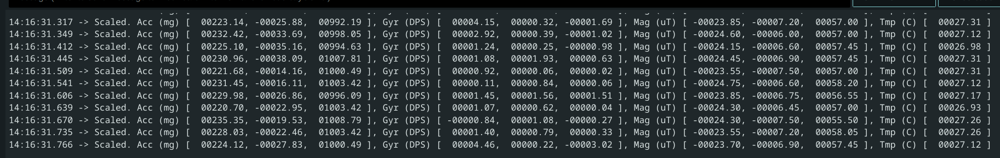

The accelerometer will generally have one vector that has a magnitude that is approx 900-1000, which is the way gravity is pulling. Rotating the IMU will change how the gravity vector is displayed. Lying the IMU flat on the table shows the z axis with a value of around 1030. Rotating it so that the Y axis points straight up will cause the y axis to read a value of around 990. Rotating again so that the x axis points straigh up will change it so that the x value of the accel will read around 980.

The gyro values hover around zero but will spike whenever the IMU is rotated. The values will spike when the IMU is rotated around a particular axis ie, the x value will spike when rotating the IMU around the x axis. The values also seem to max out at +- 250.

## Accelerometer

The accelerometer in the IMU measures the acceleration in X, Y, and Z. This data can be used to calculate pitch and roll, because gravity can be used as a reference direction, since gravity always points the same way (down). Using the ``atan2()`` function to allow for the correct range of angles, I calculated pitch and roll from the accelerometer values and saved them into arrays, which were then sent via bluetooth to my computer for further processing.
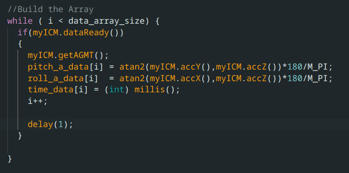

To test that the accelerometer was calibrated correctly, I temporarily printed out the values of pitch and roll to the serial monitor, and confirmed I was able to get +-90 in both pitch and roll, using the desk as a reference.
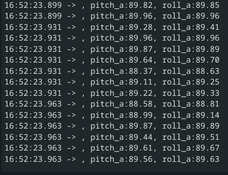
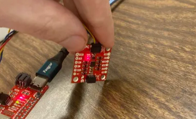

However, as can perhaps be seen in the screenshots, there was some noise in the accelerometer data. The worst noise however, shows up when the IMU is slightly bumped or vibrated, which can cause massive changes in the pitch and roll data for short periods of time despite the IMU not moving perceptively. To figure out the frequency components of this amplified noise, I left the accelerometer flat on the table and recorded data, once with no vibrations, and once while lightly hitting the table, making sure the IMU did not move or change orientation. I then took the fourier transform of the two datasets for both pitch and roll and compared their noise.

#### Pitch and Roll FFTs with no vibrations:
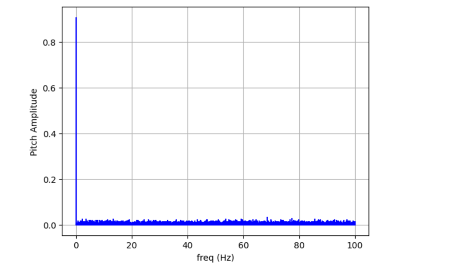
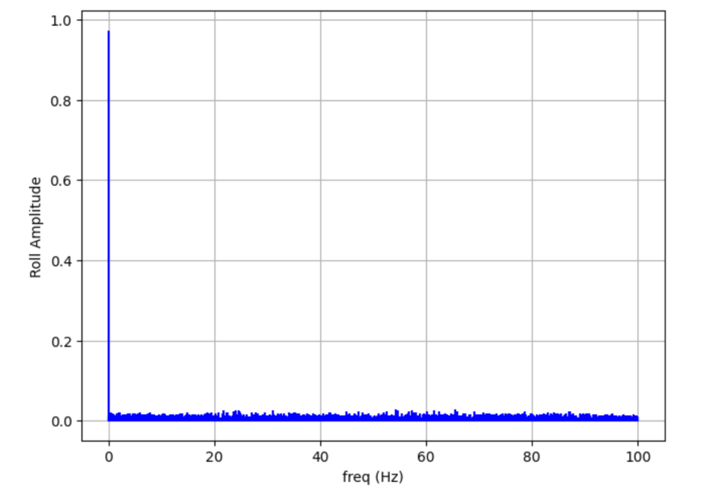

#### Pitch and Roll FFTs with vibrations:
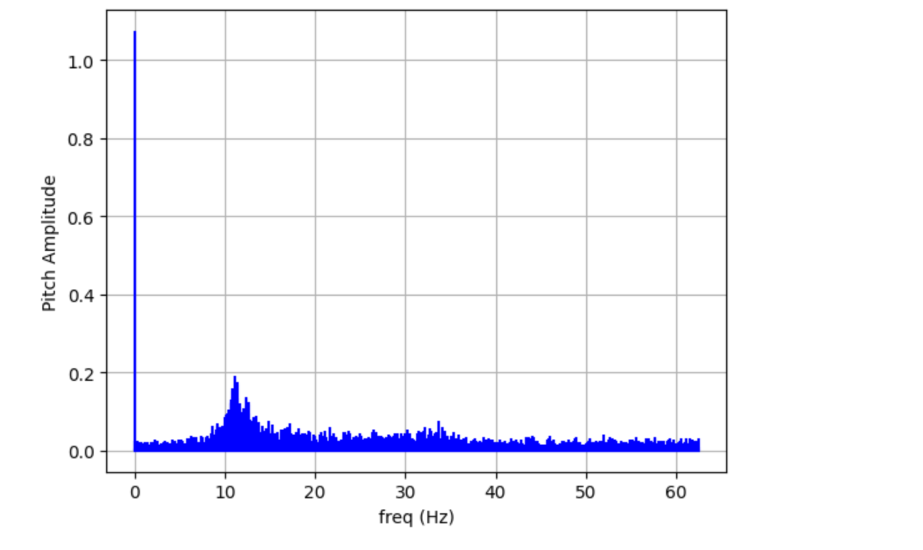
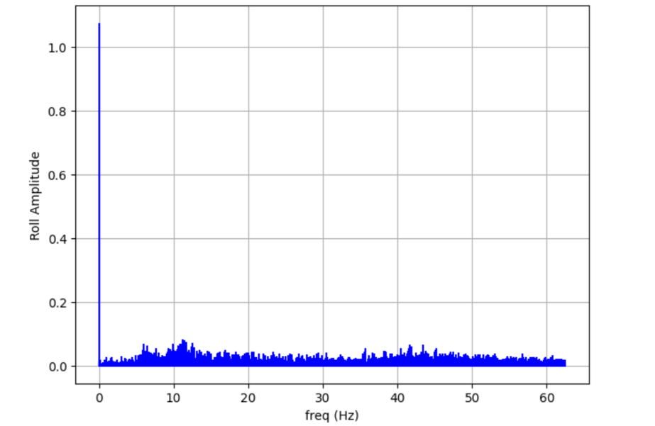

The high frequency changes in pitch and roll had spiked more than they really should have for how little the IMU actuall moved, and so I implemented a low pass filter. However, before I did that, I noticed that only a section of the nosie had risen above bacground noise. I had made sure I had been hitting the desk at random freqencies, so the fact that only the noise around 10 Hz got amplified above background noise was interesting.

I found a potential explaination for this in the datasheet for the IMU, which explains that the accelerometer (and in fact all of the sensors) have programable low-pass filters, one of which could have been turned on by default to reduce the noise above around 10 Hz. 
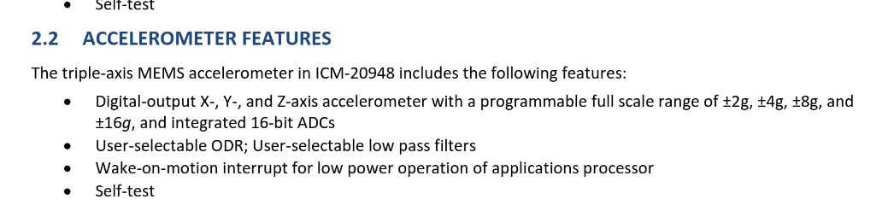

### Software low pass filter
Even with the built-in low-pass filter, there was still noise in the frequency spectrum that did not reflect the actual movement of the IMU. I decided to make my cuttoff frequency at around 5 Hz. My code's sampling frequency caputured IMU data consistently at one sample every 8 ms. Using the sample low-pass filter code from lecture as a baseline, I used these two numbers to calculate an alpha  value for the LPF, where dt = 1/(sampling rate), RC = 1/(2(pi)cutoff freq), and alpha=dt/(dt+RC). 
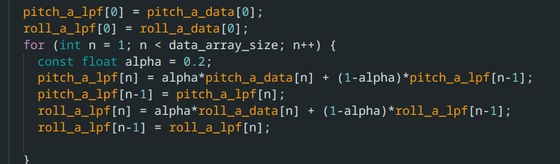

The new FFTs for a still IMU were much less noisy than using the raw data
#### Low-Passed Pitch and Roll FFTs with vibrations:
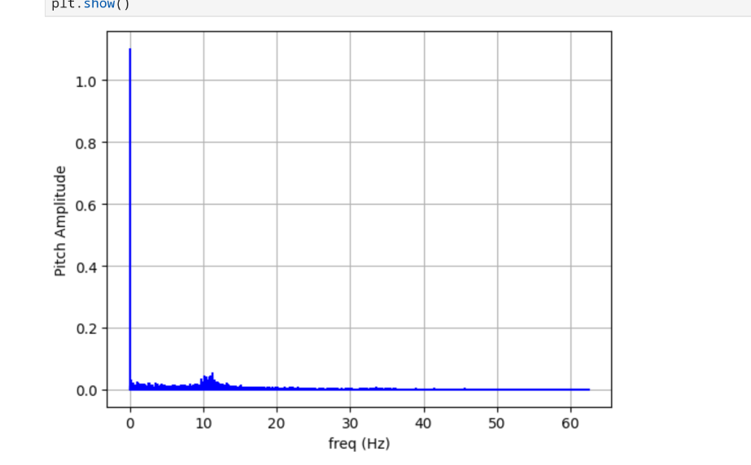
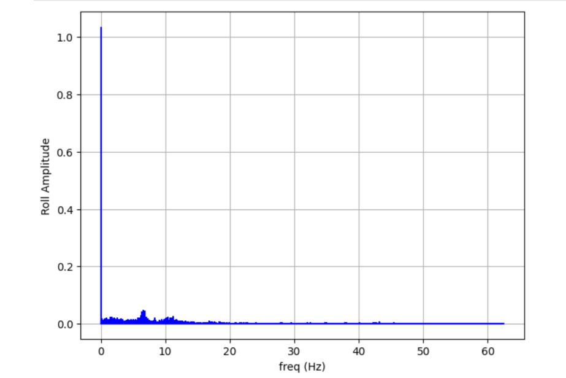

#### Low-Passed vs Raw Pitch data for normal movement
However, the best example of the low-pass filter improving this can be seen when moving the IMU in ways that are more reasonable. As can be seen by the comparison, the Low-Passed Pitch data is much smoother than the raw data
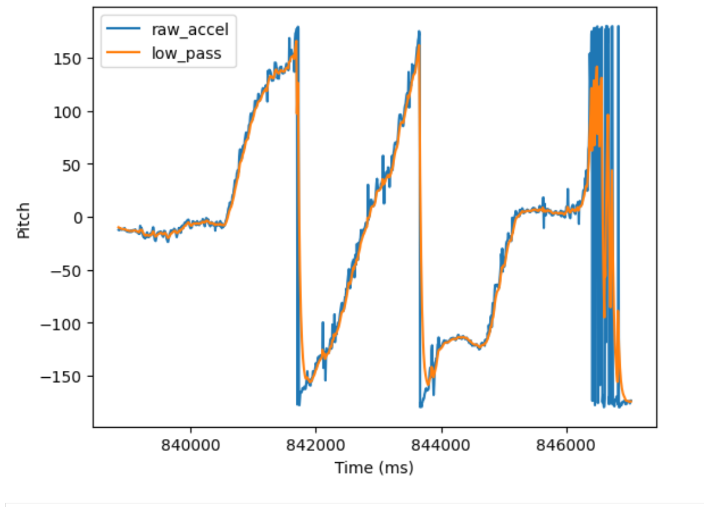

## Gyroscope

The gyroscope measures the angular change in degrees per second of the IMU in the X, Y and Z axis. By integrating this change over time, we can calculate the pitch, roll, AND yaw of the IMU. 
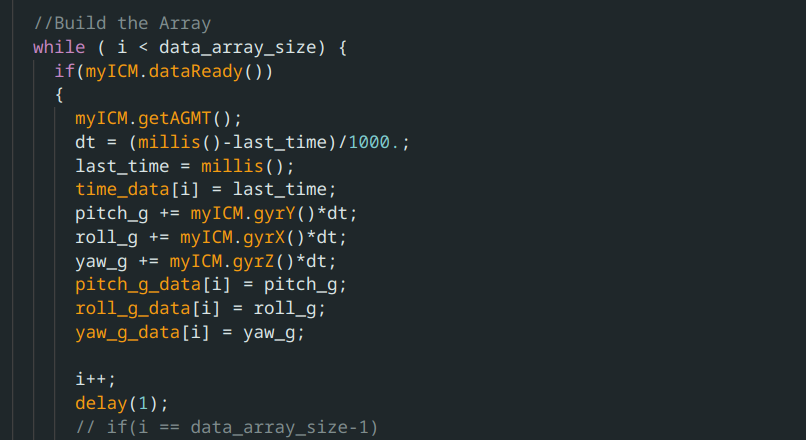

