* [Main](index.md)

# Lab 2: Artemis Board and Bluetooth


## Set up IMU

This lab involved the use of an external IMU. The setup to using the IMU with the Artemis board comprised simply of downloading the Sparkfun ICM 20948 library and conncting the IMU to the Artemis board with a QWIIC connector. 


Once the two boards were connected, the IMU was tested by running the ``example1_basics``code provided in the ICM 20948 library. This code simply printed the outputs of the IMU to the serial monitor so that I could verify they were working. Additionaly, because the ADR jumper was not closed, in order for the data to be outputted correctly, the ADO-VAL variable needed to be set to 1. 

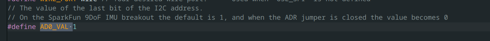
The accelerometer will generally have one vector that has a magnitude that is approx 900-1000, which is the way gravity is pulling. Rotating the IMU will change how the gravity vector is displayed. Lying the IMU flat on the table shows the z axis with a value of around 1030. Rotating it so that the Y axis points straight up will cause the y axis to read a value of around 990. Rotating again so that the x axis points straigh up will change it so that the x value of the accel will read around 980.

The gyro values hover around zero but will spike whenever the IMU is rotated. The values will spike when the IMU is rotated around a particular axis ie, the x value will spike when rotating the IMU around the x axis. The values also seem to max out at +- 250.

## Accelerometer

The accelerometer in the IMU measures the acceleration in X, Y, and Z. This data can be used to calculate pitch and roll, because gravity can be used as a reference direction, since gravity always points the same way (down). Using the ``atan2()`` function to allow for the correct range of angles, I calculated pitch and roll from the accelerometer values and saved them into arrays, which were then sent via bluetooth to my computer for further processing.


To test that the accelerometer was calibrated correctly, I temporarily printed out the values of pitch and roll to the serial monitor, and confirmed I was able to get +-90 in both pitch and roll, using the desk as a reference.


However, as can perhaps be seen in the screenshots, there was some noise in the accelerometer data. The worst noise however, shows up when the IMU is slightly bumped or vibrated, which can cause massive changes in the pitch and roll data for short periods of time despite the IMU not moving perceptively. To figure out the frequency components of this amplified noise, I left the accelerometer flat on the table and recorded data, once with no vibrations, and once while lightly hitting the table, making sure the IMU did not move or change orientation. I then took the fourier transform of the two datasets for both pitch and roll and compared their noise.

#### Pitch and Roll FFTs with no vibrations:


#### Pitch and Roll FFTs with vibrations:


The high frequency changes in pitch and roll had spiked more than they really should have for how little the IMU actuall moved, and so I implemented a low pass filter. However, before I did that, I noticed that only a section of the nosie had risen above bacground noise. I had made sure I had been hitting the desk at random freqencies, so the fact that only the noise around 10 Hz got amplified above background noise was interesting.

I found a potential explaination for this in the datasheet for the IMU, which explains that the accelerometer (and in fact all of the sensors) have programable low-pass filters, one of which could have been turned on by default to reduce the noise above around 10 Hz. 


### Software low pass filter
Even with the built-in low-pass filter, there was still noise in the frequency spectrum that did not reflect the actual movement of the IMU. I decided to make my cuttoff frequency at around 5 Hz. My code's sampling frequency caputured IMU data consistently at one sample every 8 ms. Using the sample low-pass filter code from lecture as a baseline, I used these two numbers to calculate an alpha  value for the LPF, where dt = 1/(sampling rate), RC = 1/(2(pi)cutoff freq), and alpha=dt/(dt+RC). 


The new FFTs for a still IMU were much less noisy than using the raw data
#### Low-Passed Pitch and Roll FFTs with vibrations:


#### Low-Passed vs Raw Pitch data for normal movement
However, the best example of the low-pass filter improving this can be seen when moving the IMU in ways that are more reasonable. As can be seen by the comparison, the Low-Passed Pitch data is much smoother than the raw data


## Gyroscope

The gyroscope measures the angular change in degrees per second of the IMU in the X, Y and Z axis. By integrating this change over time, we can calculate the pitch, roll, AND yaw of the IMU. 


Although the data from the gyroscope was much less noisy than the data derived from the accelerometer, as shown by the FFTs, the gyro had its own problems.

Since the data from the gyroscope had to be integrated, any small errors would be accumlulated over time and cause the calculated pitch, roll, and yaw to drift over time.

Setting the IMU flat on the table with no external movements or large vibrations, shows that the drift from these errors could get extremely large.
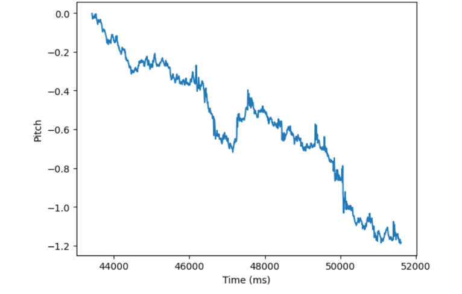

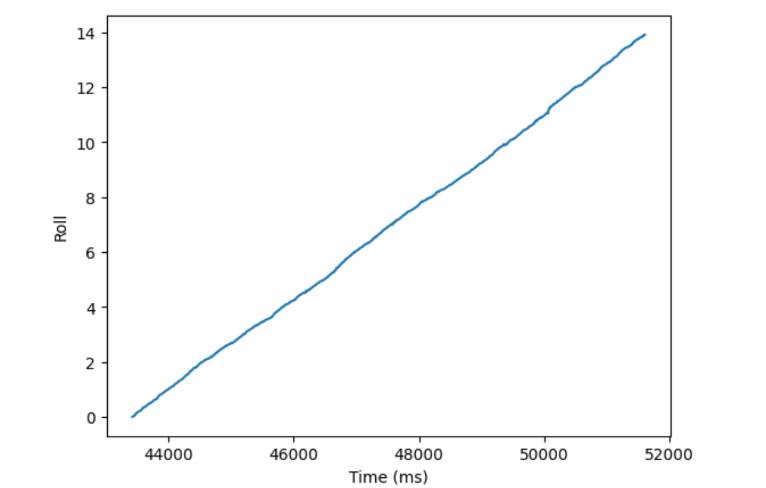
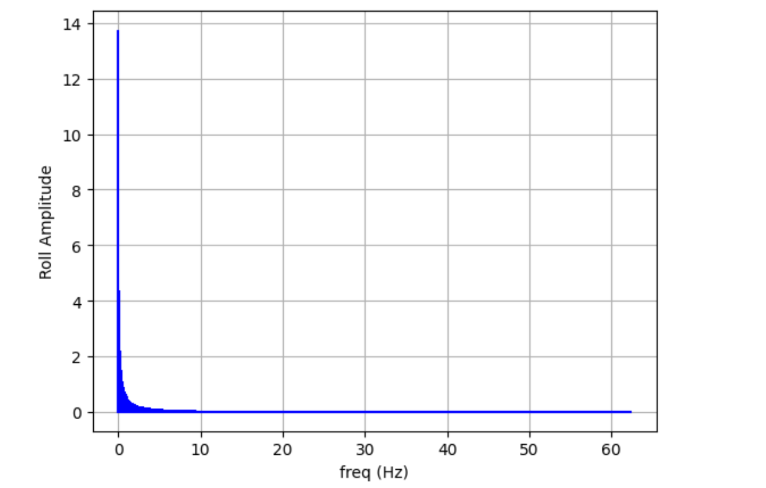
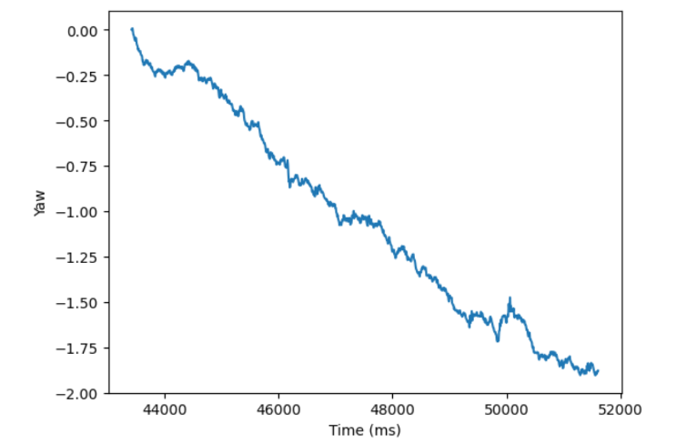
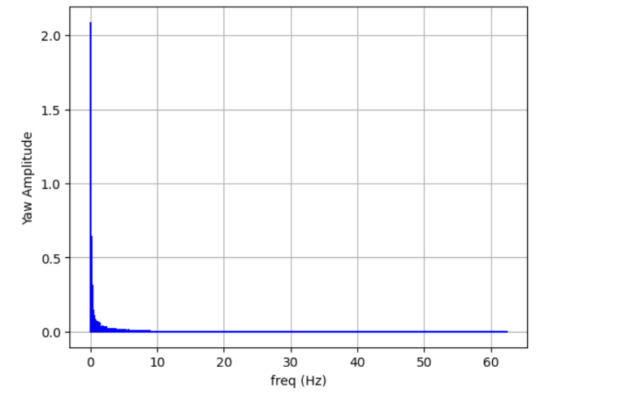

Due to what I assume are manufaturing imperfections, the calculated Roll data always had the drift, drifting up to 14 degrees over a period of around 8 seconds. 

#### Complementary filter
To solve this problem, I implemented a complementary filter, which fused the measurements of the accelerometer and the gyroscope. 

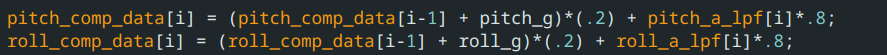

I deicided to heavily weight the filter towards the accelerometer because the drift on the gyros was so bad, and the low pass filter had seemed to fix most of the issues.

A comparison of all 4 methods of measuring pitch and roll was made, running all 4 methods at the same time, therefore measuing the same movement, which was semi-random rotations in all 3 axis.

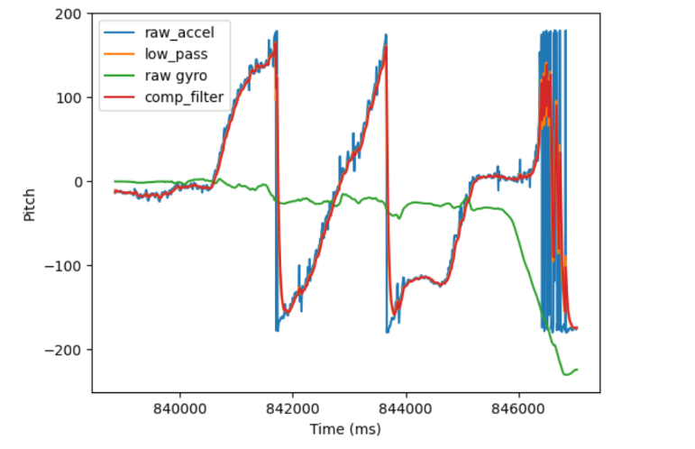

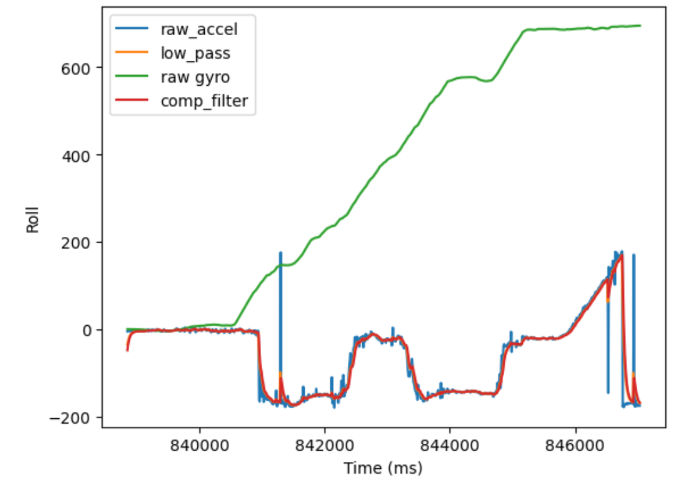

As can be seen, the drift on the gyro completely dominated any measurements and brought the roll outside of the expected rand of (-180,180).

As for Yaw, since the accelerometer cannot measure yaw, the only available measurements are from the gyro.
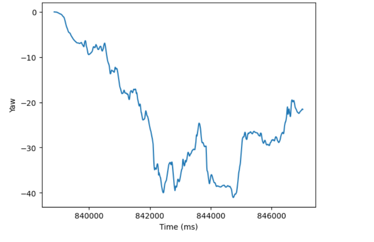

## Sampling Data

My final data was captured using the bluetooth command ``GET_IMU_READINGS``, which gathered the data in this loop:
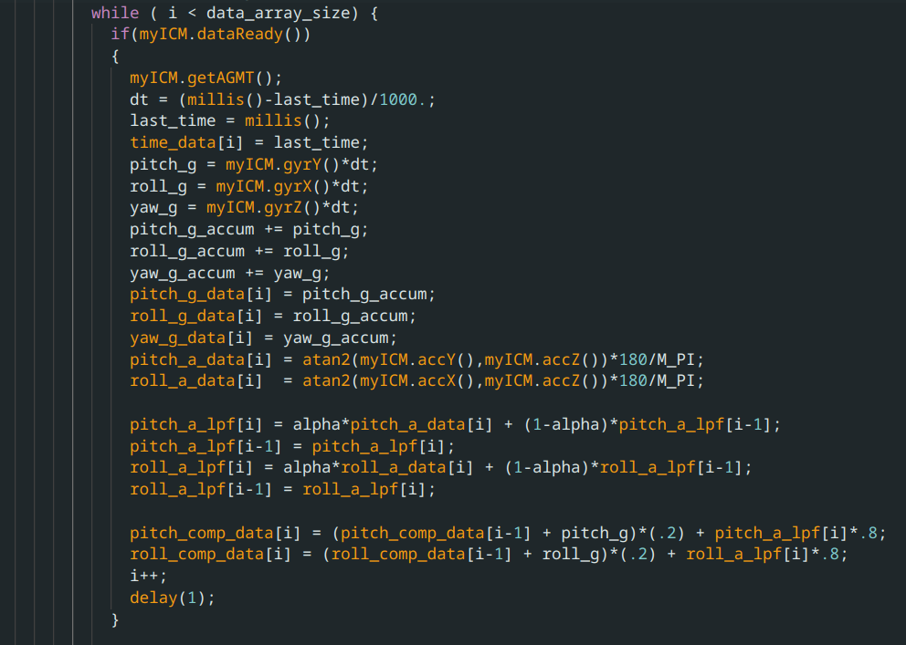

At the end of this loop there is a delay for 1 milliseconds, as there is at the end of all data collection loops used in this lab. I initially ran these loops without this delay, but found that the loop would run faster than the IMU could gather data, and there would be duplicate data in the array sent, with inconistent time distances between new data, which made it impossible to do any sort of analysis on the frequency spectrum. I discovered that adding a delay statement at the end fixed this, even when the delay was shorter than the IMU could get data. Even with just a ``delay(1)``, the data now came in exactly every 8ms.
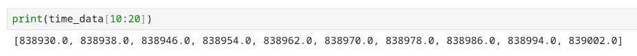

To be honest I don't really understant how adding a 1 ms delay could cause data to line up to every 8ms, but it was extremely consistent. 

This sampling rate means that 1024 samples is 8.192 seconds of data. The comparision data shown in the previous section of this report is an example of this 8 second 

All the data is recieved and stored into array for processing using this code in jupyter notebook:
```
pitch_comp = []
roll_comp = []
pitch_g = []
roll_g = []
yaw_g = []
pitch_a = []
roll_a = []
pitch_a_lpf = []
roll_a_lpf = []
time_data = []
def notif_handler(uuid, bytes):
    s = ble.bytearray_to_string(bytes)
    if("|" in s):
        sep_notif = s.split("|")
        pitch_comp.append(float(sep_notif[0]))
        roll_comp.append(float(sep_notif[1]))
        pitch_a.append(float(sep_notif[2]))
        roll_a.append(float(sep_notif[3]))
        pitch_a_lpf.append(float(sep_notif[4]))
        roll_a_lpf.append(float(sep_notif[5]))
        pitch_g.append(float(sep_notif[6]))
        roll_g.append(float(sep_notif[7]))
        yaw_g.append(float(sep_notif[8]))
        time_data.append(float(sep_notif[9]))

    
ble.start_notify(ble.uuid['RX_STRING'], notif_handler)
```
## Stunt!
This lab we also recieved the car that will act as the differential drive for our robot. Driving it around gave me a feel for how the car feels, and how easy it is to flip over and/or crash (very easy).


[](http://www.youtube.com/watch?v=6xkjqmd1Nfg)

<!-- #### Postscript
This was the week I had the flu and I think the gyro measurements I have right now are bad enough to suspect either I did something wrong or the gyro did but I ran out of time to go to office hours and check. -->
