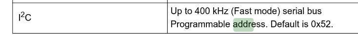
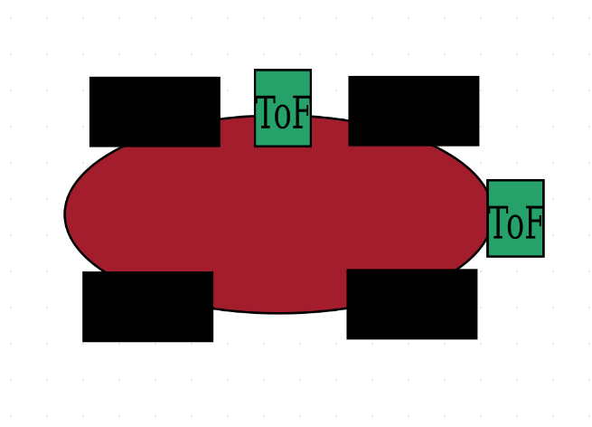
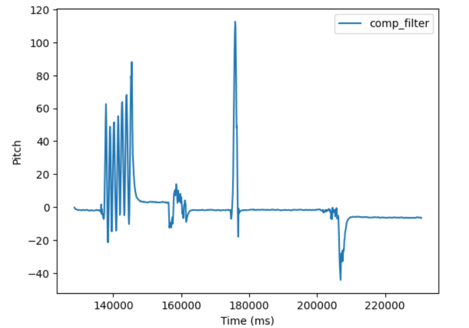
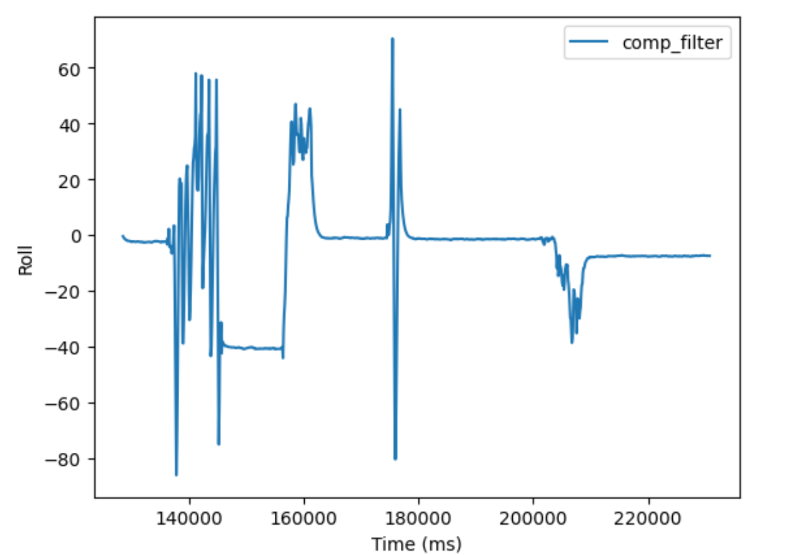
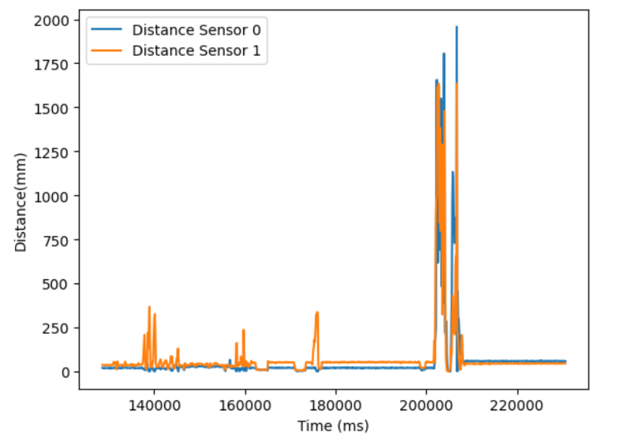

* [Main](index.md)

# Lab 3: ToF Sensor

## Prelab


### I2C

Reading the datasheet before lab informed that the ToF sensors communicate over I2C, and that the default address of the sensor is 0x52


### ToF Sensors

The plan fo rthe robot is for it to use 2 ToF sensors so that the Artemis board can receive distance information from multiple directions. Because both ToF sensors have the same address, one of the addresses needs to be changed so that both can be operated simultaneously. This is done by wiring a shutdown pin on one ToF sensor to the Artemis board so that it can be turned off while the address of the opposing sensor is changed.

### Placement of ToF sensors

I plan to place my two ToF sensors on perpendicular sides of the car, so that the car can both see how far ahead walls are to avoid crashing, and so that it can see how close it is to a parallel wall, which should help it with localization.


### Wiring Diagram

## Lab Tasks

### Artemis Board on battery Power

The first Step of this lab was to solder one of our 650 mAh batteries to a JST connector and confirm that the artemis can be run on battery power


Once the battery connections were soldered and I confirmed the artemis board was recieving power, I made sure that I could still connect to the board over bluetooth from my computer.

[](https://youtu.be/nhAY_MsQIUk)

### QUIIC connections to ToF sensors

The next step of the lab was to solder the chosen QUIIC connector cables to the ToF sensors, and then wire them up to the Artemis board.


### I2C Device Scanning

By wiring up a single ToF sensor to the Artemis board and running the Apollo3 example code `Example1_wire_I2C`, the address of the ToF sensor could be found and printed to the serial monitor. 


The printed address was 0x29, instead of the expexted address of 0x52, because I2C uses the LSB to indicate a read or a write, so the actual address is 0x29 shifted left 1 bit, which results in the expected adress of 0x52 from the datasheet.

### Chosing Distance Mode

The ToF sensor has 3 distance modes that can be chosen, each of which have their own advantages. 

From the datasheet, the advantage of the shortest range distance mode is that it is largely immune to ambient light. Given that the robot is meant to operate in a lit room with potentially changing lighting conditions depending on the time of day (there are windows in the lab), the distance mode short was chosen to ensure the robots behavior is consistent, no matter the lighting coditions.

### Testing a single ToF sensor

After the sensors had been soldered, I wired uo a single ToF sensor with a QUIIC connector, and ran the example code `Example1_ReadDistance`. This code is meant to simply read data from the ToF sensor and print it to serial. 

[](https://youtu.be/lg2vxezanGg?)

As is shown in the video, the ToF sensor is reading the distance data anc changing the distance value printed to the serial monitor as the camera gets closer to the sensor.

### Testing multiple ToF sensors in parallel.
To get multiple sensors working in parallel, I needed a way to change the address of one of the sensors so that they wouldn't both be 0x52, and I could communicate with both independently. To do this, I wired a shutdown pin on one of the sensors to a GPIO pin on the artemis, and then used the following code to shut down that sensor, change the address of the remaining sensor, and the turn back on the original sensor so that I now had two active ToF sensors with different addresses.  
```
//Optional interrupt and shutdown pins.
#define SHUTDOWN_PIN 8
//interup pin does not matter
#define INTERRUPT_PIN 3

SFEVL53L1X distanceSensor0;
//Uncomment the following line to use the optional shutdown and interrupt pins.
SFEVL53L1X distanceSensor1(Wire, SHUTDOWN_PIN, INTERRUPT_PIN);
```
```
Wire.begin();

  Serial.begin(115200);
  Serial.println("VL53L1X Qwiic Test");
  pinMode(SHUTDOWN_PIN, OUTPUT);

  // Set the address of TOF1 to 0xf5
  digitalWrite(SHUTDOWN_PIN, LOW); // Shut down TOF2
  distanceSensor1.setI2CAddress(0xf5);
  digitalWrite(SHUTDOWN_PIN, HIGH); // Restart TOF2
  ```
Once this code was added, I simply duplicated the code in `Example1_ReadDistance` that printed out the distances to serial so that both sensors' data would be printed out.

[](https://youtu.be/03DYZNHj9gc?)


### ToF Sensor Speed

One problem with the example code that I was testing with that would have to be fixed before the code was implememted was that the code would hang while it waited to get the sensor data.

```
while (!distanceSensor0.checkForDataReady())
{
    delay(1);
}
```
In future labs, it is important that the Artemis board can do other computations while the sensors are gathering data. To do this, I created a loop that continuously prints the current time to serial, and only prints the sensor data if it is available.

```
void loop(void)
{
  
  if (distanceSensor0.checkForDataReady())
  {
    int distance0 = distanceSensor0.getDistance(); //Get the result of the measurement from the sensor
    distanceSensor0.clearInterrupt();
    distanceSensor0.stopRanging();

    Serial.print("Distance0(mm): ");
    Serial.print(distance0);

    Serial.println();
    distanceSensor0.startRanging(); //Write configuration bytes to initiate measurement
  }
  if (distanceSensor1.checkForDataReady())
  {
    int distance1 = distanceSensor1.getDistance(); //Get the result of the measurement from the sensor
    distanceSensor1.clearInterrupt();
    distanceSensor1.stopRanging();

    Serial.print("Distance1(mm): ");
    Serial.print(distance1);

    Serial.println();
    distanceSensor1.startRanging(); //Write configuration bytes to initiate measurement
  }
  int time = millis();
  Serial.print("Time:");
  Serial.println(time);
}
```

By doing so, we can see that the limiting factor in how fast the sensor data can be printed is that the the sensors take 89 ms to get new data to the board, which is very slow and lets the board do a lot of computations in the meantime.


### Sending timestamped data over bluetooth

After I confirmed I could run a loop on the Artemis continuously while printing timestamped ToF data, I combined this code with the code from the end [Lab 2](lab2.md) to send a section of timestamped ToF and IMU data over bluetooth.

```
case GET_IMU_AND_TOF_READINGS:
          {
            int i = 0;
            float pitch_g = 0, roll_g = 0, yaw_g = 0, dt =0, pitch_g_accum = 0, roll_g_accum = 0, yaw_g_accum = 0;
            unsigned long last_time = millis();
            const float alpha = 0.2;

              //Build the Array
              while ( i < data_array_size) {
                if(myICM.dataReady() && distanceSensor0.checkForDataReady() && distanceSensor1.checkForDataReady())
                {
                  myICM.getAGMT();
                  dt = (millis()-last_time)/1000.;
                  last_time = millis();
                  time_data[i] = last_time;
                  pitch_g = myICM.gyrY()*dt;
                  roll_g = myICM.gyrX()*dt;
                  yaw_g = myICM.gyrZ()*dt;
                  pitch_g_accum += pitch_g;
                  roll_g_accum += roll_g;
                  yaw_g_accum += yaw_g;
                  pitch_g_data[i] = pitch_g_accum;
                  roll_g_data[i] = roll_g_accum;
                  yaw_g_data[i] = yaw_g_accum;
                  pitch_a_data[i] = atan2(myICM.accY(),myICM.accZ())*180/M_PI; 
                  roll_a_data[i]  = atan2(myICM.accX(),myICM.accZ())*180/M_PI;
                  
                  pitch_a_lpf[i] = alpha*pitch_a_data[i] + (1-alpha)*pitch_a_lpf[i-1];
                  pitch_a_lpf[i-1] = pitch_a_lpf[i];
                  roll_a_lpf[i] = alpha*roll_a_data[i] + (1-alpha)*roll_a_lpf[i-1];
                  roll_a_lpf[i-1] = roll_a_lpf[i];

                  pitch_comp_data[i] = (pitch_comp_data[i-1] + pitch_g)*(.2) + pitch_a_lpf[i]*.8;
                  roll_comp_data[i] = (roll_comp_data[i-1] + roll_g)*(.2) + roll_a_lpf[i]*.8;

                  distance_data0[i] = distanceSensor0.getDistance(); //Get the result of the measurement from the sensor
                  distanceSensor0.clearInterrupt();

                  distance_data1[i] = distanceSensor1.getDistance(); //Get the result of the measurement from the sensor
                  distanceSensor1.clearInterrupt();
                  

                  i++;
                  delay(1);
                }
                  
              }

              for (int j = 0; j < data_array_size; j++) {

                if(time_data[j] == 0)
                break;

                tx_estring_value.clear();
                // tx_estring_value.append("Sample ");
                // tx_estring_value.append(j);
                // tx_estring_value.append(": Pitch is ");
                tx_estring_value.append(pitch_comp_data[j]);
                tx_estring_value.append("|");
                tx_estring_value.append(roll_comp_data[j]);
                tx_estring_value.append("|");
                tx_estring_value.append(pitch_a_data[j]);
                tx_estring_value.append("|");
                tx_estring_value.append(roll_a_data[j]);
                tx_estring_value.append("|");
                tx_estring_value.append(pitch_a_lpf[j]);
                tx_estring_value.append("|");
                tx_estring_value.append(roll_a_lpf[j]);
                tx_estring_value.append("|");
                tx_estring_value.append(pitch_g_data[j]);
                tx_estring_value.append("|");
                tx_estring_value.append(roll_g_data[j]);
                tx_estring_value.append("|");
                tx_estring_value.append(yaw_g_data[j]);
                tx_estring_value.append("|");
                tx_estring_value.append(distance_data0[j]);
                tx_estring_value.append("|");
                tx_estring_value.append(distance_data1[j]);
                tx_estring_value.append("|");
                tx_estring_value.append(time_data[j]);
                tx_characteristic_string.writeValue(tx_estring_value.c_str());

              }

              Serial.println("Sent time many times");
          break;
          }
```

The data could then be graphed in jupyter lab:





