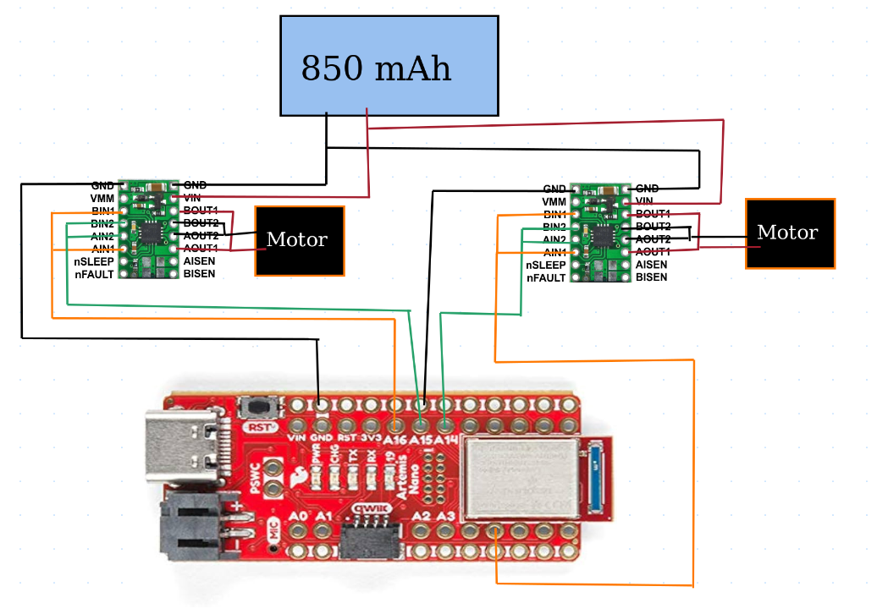
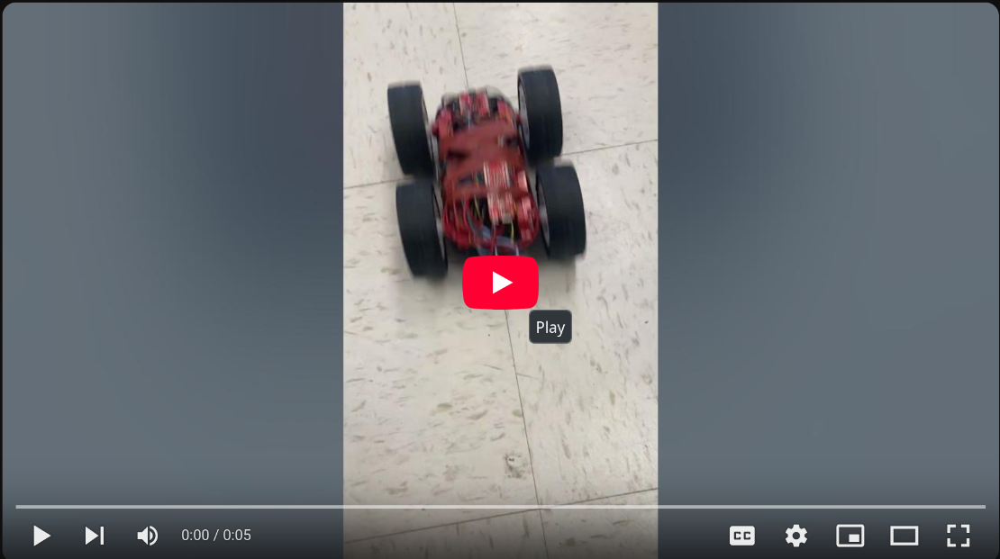

* [Main](index.md)

# Lab 4: Motor Controllers

## Prelab

### Motor driver Wiring
Analog pins A16, A15, A14, and A5 were chosen to send the pwm signals to the motor drivers.

### Battery Discussion
The Artemis board is powered by a 650 mAh battery that is wired to he board via a JST connector that was soldered to the battery's wires in lab 3. A larger, 850 mAh battery powers the motor drivers. This is done because the motors require much more power than the Artemis, and so separating the power sources allows the batteries to not be overstressed or run out of energy too quickly.

## Lab Tasks

### PWM Testing

After soldering one motor driver to the Artemis board, I needed to test it to make sure it's connections were solid before I connected it to the batteries and attached it to the car. I did this by powering the driver with a power supply set to 3.7V, and probed the output of the driver with an oscilloscope. 3.7V was chosen as the driver datasheet claims that the driver can be powered with anywhere from 2.7V - 10V, and so 3.7 seemed like it would have a comfortable margin for error without going overkill (also the power supply happened to be set to 3.7V when I turned it on).

The code I used to test the pwm signals being sent to the motor driver was inspired by Nila Narayan (2024)'s code, in whihc the pwm signals are changed from their minimum to their maximum rates.
```
void setup() {
  // put your setup code here, to run once:
  //RIGHT MOTOR
  pinMode(16, OUTPUT);
  pinMode(15, OUTPUT);

}

void loop() {
  // put your main code here, to run repeatedly:
    analogWrite(16,0);
    for (int i = 0; i < 255; i++) {
        analogWrite(16,i);
        analogWrite(15,0);
        delay(50);
    }
}
```
[](https://youtu.be/DZyrfhJ27EQ)

Once I confirmed that I had soldered on all the connections correctly for one driver, I soldered the connections of a second driver to the Artemis. I then expanded my test code to send the inverse pwm signals of what I had sent to the original driver. Both drivers were then powered by the same 3.7V DC power source.
```
void setup() {
  // put your setup code here, to run once:
  //RIGHT MOTOR
  pinMode(16, OUTPUT);
  pinMode(15, OUTPUT);
  //LEFT MOTOR
  pinMode(14, OUTPUT);
  pinMode(5, OUTPUT);

}

void loop() {
  // put your main code here, to run repeatedly:
  analogWrite(16,0);
  for (int i = 0; i < 255; i++) {
    analogWrite(16,i);
    analogWrite(15,0);
    analogWrite(14,255-i);
    analogWrite(5,0);
    delay(50);
  }
}
  ```

[](https://youtu.be/tViydWCeSZ8)

### Motor testing

After confirming that I could send the correct signals to the motors, I wired them up one at a time and tested that the motors would in fact turn as commanded by the drivers. Additionally, I wired up the drivers' power to the battery connection and powered them with the 850 mAh battery to test if it could provide enough power to the motors.

[](https://youtu.be/6xwNJlmK5p0)

[](https://youtu.be/jcahy7sl7UE)

### Securing Components to Car

After confirming that I had wired up both motor drivers and both motors correctly, I then secured all compoents to my car in such a way that the car could flip without letting any components hit the floor, and so that the Artemis board was still easily accessible. This proved to be quite a challenge, as I had left my wires longer than strictly necessary to avoid having to waste time resoldering wires that might have been just to short. Unfortunately, this had the consequence of creating a huge mess of tangled wire that I had to deal with when securing components.


### Open Loop Control

#### Straight Line
The first step in open loop control was to command the robot to go in a straight line. The trick to this however, was that my motors did not spin at the same rate when given identical pwm signals. Instead, the right motor spun faster than the left motor, and the car pulled to the left. To correct this, I decreased the rate of the pwm signal sent to the the right motor by 10 until the car went basically straight, and then tuned both motors from there. Starting with sending the motors this code:
```
analogWrite(16,0);
analogWrite(15,100);
analogWrite(14,100);
analogWrite(5,0);
  ```
I ended up getting the car to co straight with this code:
  ```
analogWrite(16,0);
analogWrite(15,70);
analogWrite(14,105);
analogWrite(5,0);
  ```
Giving me a calibration coefficent for the left motor of 1.5.
[](https://youtu.be/McWnx_pHqbo)

#### Lower bound on pwm signals

The next test I did with my car was to find out how low I could make the values of the pwm signal and still have the car start to move. Including the 1.5 calibration coefficent for the left motor, I started from pwm values of 0 and increased them by 5 until the robot moved smoothly without starting and stopping. I found the slowest the robot could move slowly was with a pwm vale of 35.
```
analogWrite(16,0);
analogWrite(15,35);
analogWrite(14,35*1.5);
analogWrite(5,0);
```
[](https://youtu.be/MzQQo3wcODw)

#### Adding Turns

The final step I added was the add in a turn to the robot by spinning its wheels in opposite directions. By chance, I very nearly landed on the timing needed for a 180 degree turn on my first try.
```
delay(5000);
//straight line
analogWrite(16,0);
analogWrite(15,70);
analogWrite(14,105);
analogWrite(5,0);
delay(2000);
//turn around
analogWrite(16,0);
analogWrite(15,70);
analogWrite(14,0);
analogWrite(5,105);
delay(2000);
//straight line
analogWrite(16,0);
analogWrite(15,70);
analogWrite(14,105);
analogWrite(5,0);
delay(2000);
//stop
analogWrite(16,0);
analogWrite(15,0);
analogWrite(14,0);
analogWrite(5,0);
```
[](https://youtu.be/iBffZh_zoLs)
