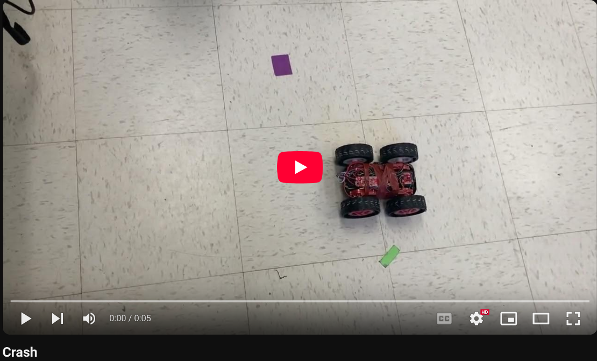
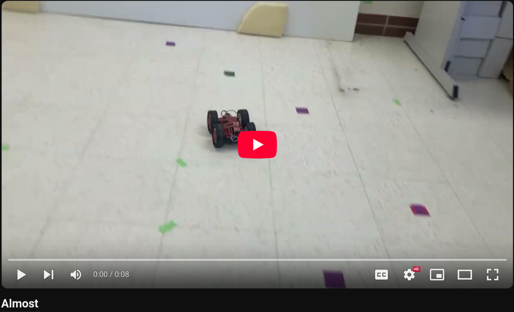
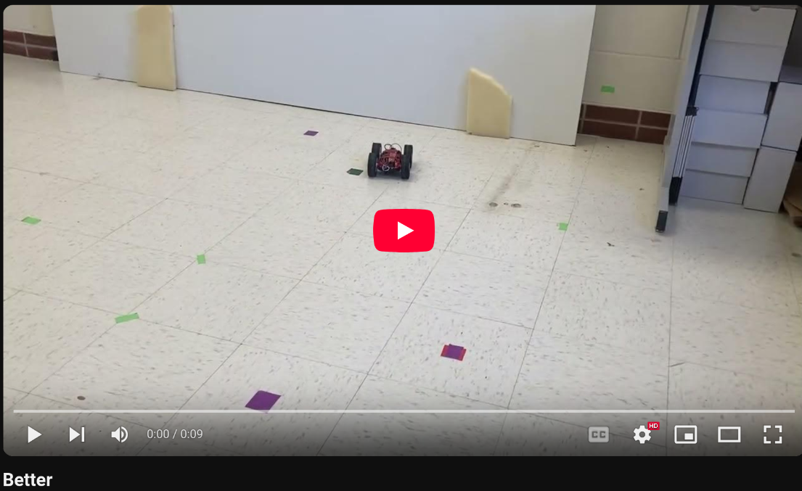
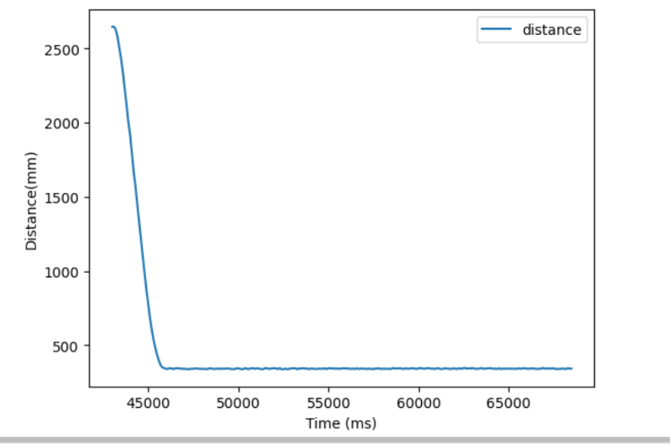
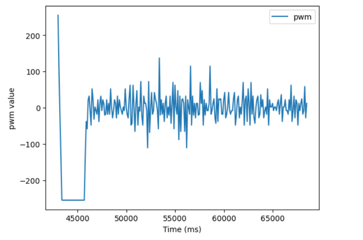
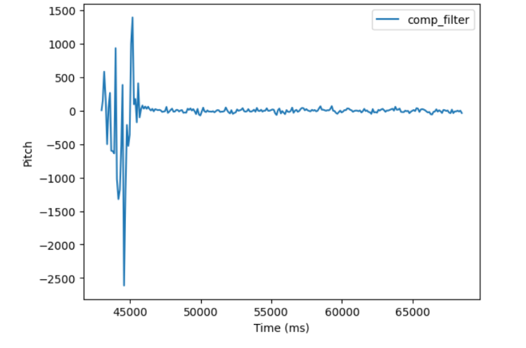
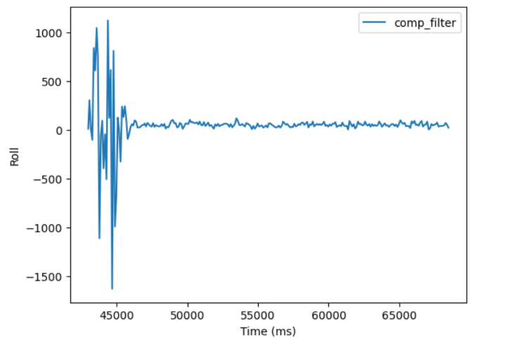
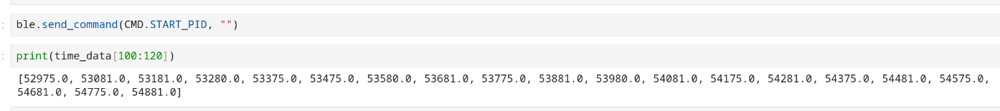
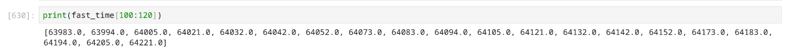

* [Main](index.md)

# Lab 5: Linear PID control

## Prelab
### Bluetooth
For this lab, the robot was going to be operating entirely on battery power, which meant that all commands to the robot needed to be sent over bluetooth. To accomplish this in an efficient manner, I created two cases in `ble_arduino.ino`, which would enact the functions needed for the lab when given a command over bluetooth. These two cases were `START_PID` and `CHANGE_GAIN`. 

`START_PID` was the case where the actual PID control would be implemented. Recieving this command would start the PID control, and would start filling up arrays with debugging information. Once the arrays are filled, it then sends the arrays to my computer over bluetooth. The structure of this case is as such:
```
case START_PID:
          {
            //initialize variables
            Serial.println("STARTING PID");
              //Build the Array
              while ( i < data_array_size) {
                if (ToF sensor ready){
                    //PID CONTROL
                    //save debug information in arrays of size data_array_size
                    i++;
                }
              }
              //stop robot
              analogWrite(16,0);
              analogWrite(15,0);
              analogWrite(14,0);
              analogWrite(5,0);

              for (int j = 0; j < data_array_size; j++) {
                //send debug information
                tx_estring_value.clear();
                tx_estring_value.append(distance_data1[j]);
                tx_estring_value.append("|");
                tx_estring_value.append(pwm_data[j]);
                tx_estring_value.append("|");
                tx_estring_value.append(time_data[j]);
                tx_characteristic_string.writeValue(tx_estring_value.c_str());
              }

              Serial.println("Sent time many times");
            break;
          }
```

The sent back data was then handled by a notification handler in jupyter lab:
```
def notif_handler(uuid, bytes):
    s = ble.bytearray_to_string(bytes)
    if("|" in s):
        sep_notif = s.split("|")
        distance_data1.append(float(sep_notif[1]))
        pwm_data.append(float(sep_notif[2]))
        time_data.append(float(sep_notif[3]))

    
ble.start_notify(ble.uuid['RX_STRING'], notif_handler)
```

`CHANGE_GAIN` would allow easier tuning of the PID controls, as this command could send 4 variables to the robot. These variables were the 3 PID gains, and the maximum allowable speed of the robot. These would then change global variables in the Artemis board, so that a subsequent run of the PID control could have different PID parameters.

```
       case CHANGE_GAIN:
          {
            float new_kp; float new_ki; float new_kd; float new_maxSpeed;
            
            success = robot_cmd.get_next_value(new_kp);
            if(!success)
              return;

            success = robot_cmd.get_next_value(new_ki);
            if(!success)
              return;

            success = robot_cmd.get_next_value(new_kd);
            if(!success)
              return;

            success = robot_cmd.get_next_value(new_maxSpeed);
            if(!success)
              return;

            Kp = new_kp;
            Ki = new_ki;
            Kd = new_kd;
            maxSpeed = new_maxSpeed;
            break;
          }
```

In jupyter lab, the command was sent like this:
```
ble.send_command(CMD.CHANGE_GAIN, "Kp|Ki|Kd|maxSpeed")
```

## Lab Tasks

### PID Controller code

The first task was to program in a PID controller. Because I wanted to spend the majority of my time tuning the robot rather than reprograming it and then re-flashing it, I programed a full PID controller that excecuted every time there was new ToF sensor data.
```
while ( i < data_array_size) {
    if(distanceSensor1.checkForDataReady())
    {
        //Get the result of the measurement from the sensor
        dt = (millis()-last_time);
        last_time = millis();
        time_data[i] = last_time;
        distance1 =  distanceSensor1.getDistance(); 
        //Get the result of the measurement from the sensor
        distance_data1[i] = distance1;
        distanceSensor1.clearInterrupt();
        currDist = distance1;
        old_error = error;
        error = currDist-targetDist;
        sumError = sumError + error*dt;
        Pterm = Kp * error;
        Iterm = Ki * sumError;
        Dterm = Kd * (error - old_error)/dt;
        pwm = Pterm + Iterm + Dterm;
        

        if(pwm > 0)
        {
        if(pwm > maxSpeed)
            pwm = maxSpeed;
        }
        else if(pwm < 0)
        {
        if(pwm < -maxSpeed)
            pwm = -maxSpeed;
        }
        pwm_data[i] = pwm;
        if(pwm > 35){
            analogWrite(16,0);
            analogWrite(15,pwm);
            analogWrite(14,pwm*1.25);
            analogWrite(5,0);
        }
        else if(pwm < -35){
            analogWrite(16,abs(pwm));
            analogWrite(15,0);
            analogWrite(14,0);
            analogWrite(5,abs(pwm)*1.25);   
        }
        else{
            analogWrite(16,0);
            analogWrite(15,0);
            analogWrite(14,0);
            analogWrite(5,0);
        }

        i++;
    }
}
```
This controller caps the maximum pwm signals at a maximum speed set by the user (although I usually left it at 255, which was the maximum speed of the robot), and eliminates pwm signals which are too small to move the robot.

### Initial Tuning 

To start off, I just tuned the Kp value and used only proportional control. I discovered that I needed a very small proportional value, around 0.03 to 0.05, as any larger would cause the car to barrel towards the wall as fast as possible and smash into it.

[](https://youtu.be/0S9iVVJSlb8)

Eventually I got pretty close with a Kp value of 0.04, which gave decent results, but with low precision. The car would either stop around a foot and a half away from the wall, or would stop half a foot away from the wall, depending upon how far from the wall the robot was originally placed. 

[](https://youtu.be/DS93KwNmfU8)

From this, I gathered that there were two problems that the robot needed to solve. One problem was that the robot could not make small adjustments within about a half-foot or so from the setpoint, because the pwm signals that the PID controller wanted to send to the robot were to small, and could not actually move the motors, and so were ignored. This meant that the robot would never move from a stopping distance of 1 and a half feet, since it was too close to the setpoint to try and move. 

One way to fix this would be to increase the proportional gain so that it could have enough gain to move with small errors. But this caused the original problem of smashing into the wall. I figured that part of the problem of the robot smashing into the wall when it moved too fast was because the PID controller wasn't executing fast enough to make the changes needed to stop in time. Skimming ahead in the lab intructions brought me to extrapolation, which proported to help with this issue.

### Linear Extrapolation

The goal of this modificaation to the PID controller was to increase the freqeuncy in which the controller excecuted by extrapolating the distance measurements based off of previous ones and ellapsed time. 

```
while ( i < data_array_size) {
    if(distanceSensor1.checkForDataReady())
    {
       
        dt = (millis()-last_time);
        last_time = millis();
        time_data[i] = last_time;
        distance1 =  distanceSensor1.getDistance(); 
        //Get the result of the measurement from the sensor
        distance_data1[i] = distance1;
        distanceSensor1.clearInterrupt();
        currDist = distance1;
        old_error = error;
        error = currDist-targetDist;
        //Proportional Control
        sumError = sumError + error*dt;
        Pterm = Kp * error;
        Iterm = Ki * sumError;
        Dterm = Kd * (error - old_error)/dt;
        pwm = Pterm + Iterm + Dterm;
        if(pwm > 0)
        {
        if(pwm > maxSpeed)
            pwm = maxSpeed;
        }
        else if(pwm < 0)
        {
        if(pwm < -maxSpeed)
            pwm = -maxSpeed;
        }
        pwm_data[i] = pwm;
        if(pwm > 35){
            analogWrite(16,0);
            analogWrite(15,pwm);
            analogWrite(14,pwm*1.25);
            analogWrite(5,0);
        }
        else if(pwm < -35){
            analogWrite(16,abs(pwm));
            analogWrite(15,0);
            analogWrite(14,0);
            analogWrite(5,abs(pwm)*1.25);
        }
        else{
            analogWrite(16,0);
            analogWrite(15,0);
            analogWrite(14,0);
            analogWrite(5,0);
        }

        i++;
    }
    else{
        dt = (millis()-last_time);
        last_time = millis();

        distance1 =  distance1+((distance_data1[i] - distance_data1[i-1])/(time_data[i]-time_data[i-1]))*dt;
        currDist = distance1;
        old_error = error;
        error = currDist-targetDist;
        sumError = sumError + error*dt;
        Pterm = Kp * error;
        Iterm = Ki * sumError;
        Dterm = Kd * (error - old_error)/dt;
        pwm = Pterm + Iterm + Dterm;
        if(pwm > 0)
        {
        if(pwm > maxSpeed)
            pwm = maxSpeed;
        }
        else if(pwm < 0)
        {
        if(pwm < -maxSpeed)
            pwm = -maxSpeed;
        }
        if(pwm > 35){
            analogWrite(16,0);
            analogWrite(15,pwm);
            analogWrite(14,pwm*1.25);
            analogWrite(5,0);
        }
        else if(pwm < -35){
            analogWrite(16,abs(pwm));
            analogWrite(15,0);
            analogWrite(14,0);
            analogWrite(5,abs(pwm)*1.25);
        }
        else{
            analogWrite(16,0);
            analogWrite(15,0);
            analogWrite(14,0);
            analogWrite(5,0);
        }

    }
}           
```
The extrapolation was done by creating a new extrapolated distance measurement every loop in which there was not new ToF data to use as the distance measurement.
```
 distance1 =  distance1+((distance_data1[i] - distance_data1[i-1])/(time_data[i]-time_data[i-1]))*dt;
 ```

This improved my proportional controller, allowing me to increase my Kp value to .043, and made the errors now closer to a quarter of a foot rather than a half.

[](https://youtu.be/QxYfu1APAK0)

However, I knew to properlly fix these issues I needed to increase the complexity of my controller, which I did my turning it into a PD controller.

### PD control and Success
I added a nonzero Kd value to my PID controller because when I increased my Kp value so that I could actually make small adjustments (say 0.05), I would get overshoot. Adding Derivitive control would allow my robot to know if it was approaching the wall too fast and slow down earlier. I started with a Kd value of 1, which had little effect, and so I increased it steadily until I saw a definite effect, when the Kd value was 50. I then increased it at a slower rate until I no longer overshot. I ended up with a Kp value of 0.05, and a Kd value of 90.


[](https://youtu.be/-m6k3ABnfpQ)






<!-- Additionally, I accidentally read the lab directions wrong and collected IMU data along with the ToF and PID data, which, although strictly not required for this lab, will presumably be useful in future labs.



 -->

### Timing discussion

As discussed earlier in this report, a major problem with the earlier verisons of the PID controller was the slow excecution rate due to the slow data gathering rate of the ToF sensors.



The rate at which the initial controller ran was limited by the fact that the ToF sensors only update data at around once every 100 ms. 

Extrapolation allows the PID controller to update much more frequently, albiet with less accurate data.



Extrapolation allows the controller loop to run 10 times as fast, with a new distance being extrpolated around every 10 ms.
