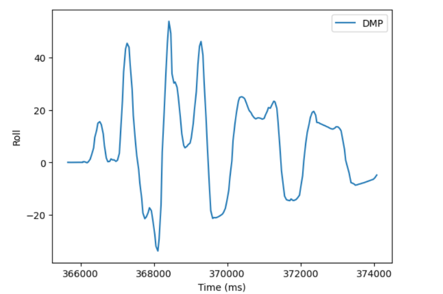

* [Main](index.md)

# Lab 6: Orientation Control

## Prelab
### Bluetooth

I handled bluetooth communication in two different ways during my implementation for this lab. The first way I handled it was the same way I had done things in previous labs. I created a case called `PID_TURN`, that would attempt to keep the robot pointed in a particular direction for a set amount of time, and halt as soon as the time ran out, and send the collected data back to my computer over bluetooth. I used this method to debug my code, as it had a hard limit as to how long the code could run for. 

The second method I used was in line with the specififications for this lab, which was to create a loop that could execute while the Artemis was still able to recieve bluetooth commands. I did this by creating two new cases, `PID_STRT_ON`, and `PID_STRT_OFF`. These commands would handle the startup and shutdown of the PID controller loop by setting a boolean, `PID_STRT` to true to start the PID loop, and to false to end it. 

`PID_STRT_ON` would clear the data arrays and then set the boolean to true.
```
case PID_STRT_ON:
          {
            for (int j = 0; j < data_array_size; j++) {

              
              pitch_data[j] = 0;
              roll_data[j] = 0;
              yaw_data[j] = 0;
              time_data[j] = 0;
              pwm_data[j] = 0;

            }
            i = 0;
            last_time = millis();
            start_time = millis();

            PID_STRT = true;
          break;
          }
```
`PID_STRT_OFF` would end the PID control loop, ensure that the robot's motors were stopped, and then send the now full data arrays to my computer over bluetooth.
```
case PID_STRT_OFF:
          {
            PID_STRT = false;
            analogWrite(16,0);
            analogWrite(15,0);
            analogWrite(14,0);
            analogWrite(5,0);
            for (int j = 0; j < i; j++) {

              if(time_data[j] == 0)
              break;

              tx_estring_value.clear();
              tx_estring_value.append(pitch_data[j]);
              tx_estring_value.append("|");
              tx_estring_value.append(roll_data[j]);
              tx_estring_value.append("|");
              tx_estring_value.append(yaw_data[j]);
              tx_estring_value.append("|");
              tx_estring_value.append(time_data[j]);
              tx_estring_value.append("|");
              tx_estring_value.append(pwm_data[j]);
              tx_characteristic_string.writeValue(tx_estring_value.c_str());

            }
          Serial.println("Sent time many times");
          break;
          }
```
The notification handler in python looked similar to previous labs:
```
pitch_DMP = []
roll_DMP = []
yaw_DMP = []
time_data_DMP = []
pwm_data_DMP = []
def notif_handler(uuid, bytes):
    s = ble.bytearray_to_string(bytes)
    if("|" in s):
        sep_notif = s.split("|")
        pitch_DMP.append(float(sep_notif[0]))
        roll_DMP.append(float(sep_notif[1]))
        yaw_DMP.append(float(sep_notif[2]))
        time_data_DMP.append(float(sep_notif[3]))
        pwm_data_DMP.append(float(sep_notif[4]))
    

    
ble.start_notify(ble.uuid['RX_STRING'], notif_handler)
```
## Lab Tasks

### DMP IMU data

This lab involved using the yaw data from the gyroscope to control the angle of the robot. This proved a problem for me, as when I implemented gyroscope data collection in [Lab 3](lab3.md), I had quite substantial drift. To remedy this, I followd this [tutorial](https://fastrobotscornell.github.io/FastRobots-2025/tutorials/dmp.html) to use the IMU's InvenSense digital motion processor (DMP), which uses readings from the accelerometer, gyroscope, and magnetometer to provide error and drift correction to the orientation readings. I created a new case, `GET_DMP_DATA', to test this new method and verify that it did not have the drift problems of previous labs.

```
case GET_DMP_DATA:
          {
            int i = 0;
            unsigned long last_time = millis();

              //Build the Array
              while ( i < data_array_size) {
                icm_20948_DMP_data_t data;
                myICM.readDMPdataFromFIFO(&data);
                if((myICM.status == ICM_20948_Stat_Ok) || (myICM.status == ICM_20948_Stat_FIFOMoreDataAvail))
                {
                  if ((data.header & DMP_header_bitmap_Quat6) > 0)
                  {
                    SERIAL_PORT.print(F("Q1:"));
                    SERIAL_PORT.print(q1, 3);
                    SERIAL_PORT.print(F(" Q2:"));
                    SERIAL_PORT.print(q2, 3);
                    SERIAL_PORT.print(F(" Q3:"));
                    SERIAL_PORT.println(q3, 3);
              

                    double q0 = sqrt(1.0 - ((q1 * q1) + (q2 * q2) + (q3 * q3)));

                    double qw = q0; // See issue #145 - thank you @Gord1
                    double qx = q2;
                    double qy = q1;
                    double qz = -q3;

                    // roll (x-axis rotation)
                    double t0 = +2.0 * (qw * qx + qy * qz);
                    double t1 = +1.0 - 2.0 * (qx * qx + qy * qy);
                    double roll = atan2(t0, t1) * 180.0 / PI;
                    roll_data[i] = roll;

                    // pitch (y-axis rotation)
                    double t2 = +2.0 * (qw * qy - qx * qz);
                    t2 = t2 > 1.0 ? 1.0 : t2;
                    t2 = t2 < -1.0 ? -1.0 : t2;
                    double pitch = asin(t2) * 180.0 / PI;
                    pitch_data[i] = pitch;

                    // yaw (z-axis rotation)
                    double t3 = +2.0 * (qw * qz + qx * qy);
                    double t4 = +1.0 - 2.0 * (qy * qy + qz * qz);
                    double yaw = atan2(t3, t4) * 180.0 / PI;
                    yaw_data[i] = yaw;
                    time_data[i] = millis();
                    i++;
                  
                  }
                }
                if (myICM.status != ICM_20948_Stat_FIFOMoreDataAvail) // If more data is available then we should read it right away - and not delay
                {
                  delay(10);
                }
                  
              }
              for (int j = 0; j < data_array_size; j++) {

                if(time_data[j] == 0)
                break;

                tx_estring_value.clear();
                tx_estring_value.append(pitch_data[j]);
                tx_estring_value.append("|");
                tx_estring_value.append(roll_data[j]);
                tx_estring_value.append("|");
                tx_estring_value.append(yaw_data[j]);
                tx_estring_value.append("|");
                tx_estring_value.append(time_data[j]);
                tx_characteristic_string.writeValue(tx_estring_value.c_str());

              }

              Serial.println("Sent time many times");
          break;
        }
```

This allowed me to store much more accurate yaw data, and alliveated the need for me to worry about low-pass or complementary filters for pitch and yaw.




Notice the lack of drift in the yaw data. Additionally, it provides positive and negative angles between 180 and -180 degrees, which means using this value directly for the PID controller ensures the robot will turn in the direction that requires the least amount of turning.
### PID Controller code

Since I had already implemented a PID controller in lab 5, setting up the code for controlling angle went smoothly. The only changes were using the IMU data instead of ToF data, and to command the robot to turn left or right instead of moving backwards or forwards to reduce the error.


```
if(PID_STRT)
{
    if ( i < data_array_size) {
    icm_20948_DMP_data_t data;
    myICM.readDMPdataFromFIFO(&data);
    if((myICM.status == ICM_20948_Stat_Ok) || (myICM.status == ICM_20948_Stat_FIFOMoreDataAvail))
    {
        if ((data.header & DMP_header_bitmap_Quat6) > 0)
        {
        
        dt = (millis()-last_time);
        last_time = millis();
        currYaw = yaw;
        old_error = error_pid;
        error_pid = currYaw-targetYaw;
        //Proportional Control
        sumError = sumError + error_pid*dt;
        Pterm = Kp * error_pid;
        Iterm = Ki * sumError;
        Dterm = Kd * (error_pid - old_error)/dt;
        pwm = Pterm + Iterm + Dterm;
        

        if(pwm > 0)
        {
            if(pwm > maxSpeed)
            pwm = maxSpeed;
        }
        else if(pwm < 0)
        {
            if(pwm < -maxSpeed)
            pwm = -maxSpeed;
        }
        pwm_data[i] = pwm;
        if(pwm > 35){
            analogWrite(16,0);
            analogWrite(15,pwm);
            analogWrite(14,0);
            analogWrite(5,pwm*1.25);
        }
        else if(pwm < -35){
            // pwm = abs(pwm);
            analogWrite(16,abs(pwm));
            analogWrite(15,0);
            analogWrite(14,abs(pwm)*1.25);
            analogWrite(5,0);
            
        }
        else{
            analogWrite(16,0);
            analogWrite(15,0);
            analogWrite(14,0);
            analogWrite(5,0);
        }
        }
    }
    if (myICM.status != ICM_20948_Stat_FIFOMoreDataAvail) // If more data is available then we should read it right away - and not delay
    {
        delay(10);
    }
        
    }
}
```
This code is located inside the main loop section of the code, and will execute if the `PID_STRT` variable has been set to true, and there is new IMU data. The IMU data appears much more often than the ToF sensor data did in [Lab 5](lab5.md) (about every 50ms), and so I did not implement extrapolation in this lab, although my issues with oscillation later in the lab might mean I should do so in the future.

Additionally, to ease tuning, I modified my `CHANGE_GAIN` case from lab 5 to also take in a new target angle.
```
case CHANGE_GAIN:
          {
            float new_kp; float new_ki; float new_kd; float new_maxSpeed; float new_targetYaw;
            
            success = robot_cmd.get_next_value(new_kp);
            if(!success)
              return;

            success = robot_cmd.get_next_value(new_ki);
            if(!success)
              return;

            success = robot_cmd.get_next_value(new_kd);
            if(!success)
              return;

            success = robot_cmd.get_next_value(new_maxSpeed);
            if(!success)
              return;

            success = robot_cmd.get_next_value(new_targetYaw);
            if(!success)
              return;

            Kp = new_kp;
            Ki = new_ki;
            Kd = new_kd;
            maxSpeed = new_maxSpeed;
            targetYaw = new_targetYaw;
            break;
          }
```

### Tuning via the kick test

Inspired by [this](https://www.youtube.com/watch?v=SExEftZorVM) video example, I initially tuned the robot via telling it to hold an angle (usually zero), and then kicking it to disturb the robot, and judging how well the robot could hold its orientation.

I started with simple P control, and got a Kp value of 3, that worked fairly consistently, albiet with a lot of oscillations.

[](https://youtu.be/Z19BwRRoxiQ)

To solve the oscillations, I started increasing the Kd value, eventually reaching a kd value of 1000. This reduced the oscillations, and revealed a small steady state error.

[](https://youtu.be/-LKQvWKWuFM)


To solve this, I decreased my Kp to 2.7, and set my Ki value to 0.0005. I also increased my Kd value from 1000 to 1500, because there was still some ocillations left over.

This combination of value gave me the best tuning I got for the kick test, with a robot that responded fast, accurately, and didn't oscillate.

[](https://youtu.be/geu81nbjcN8)

### Tuning via the 90 degree turn test

After tuning via the kick test, I wanted to get a graph of each of my tunings doing a 90 degree turn to show very clearly how the steady state error and oscillations decreased as I got better and better tunings. However, when I tried this with my optimal tuning, I got this behavior:


The robot had a huge oscillation at the begining that the kick test had totally failed to produce. I then re-tuned my PID controller to become a PI controller with a Kp gain of 1.855, and a Ki gain of 0.007. This gave me the correct behavior and graphs I wanted for a 90 degree turn, but was extremely slow when using the kick test.


I attempted to continue tuning to find a middle ground between these to tunings, but at this point the battery on my robot had started to die, making its behavior very inconsistent, and so in the interest of time (and sleep), I ended my tunings here.

## Discussion

This lab took much less time to get working initially than Lab 5, however, because of the more open ended testing methods allowed in this lab, I ended up with two different methods that produced vastly different optimal tunings. In future, I will have to continue tuning this PID controller to ensure it will meet the requirements for a specific stunt I am preforming. I might also want to implement extrapolation, as although the IMU data is quicker than the ToF data, it may still be worth having a faster PID control loop.