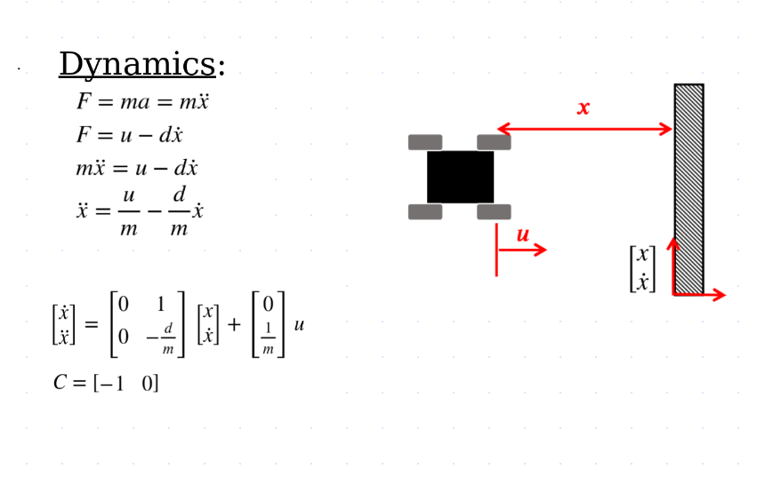
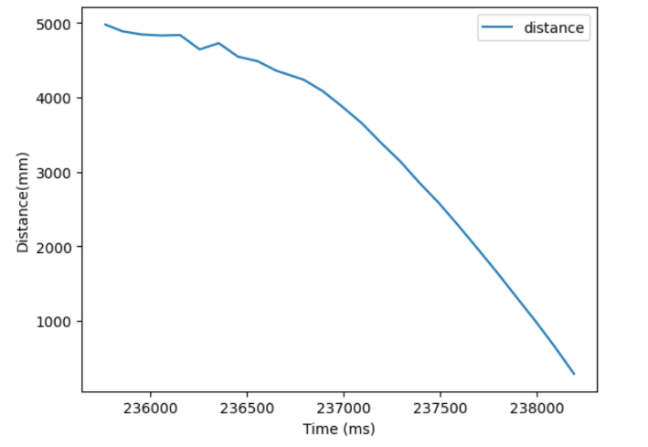
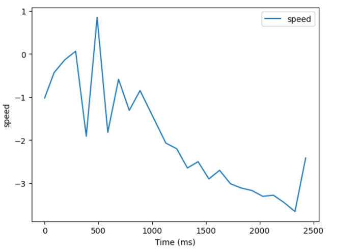
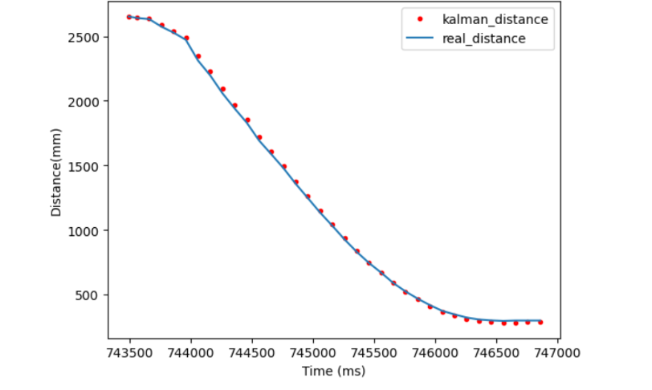
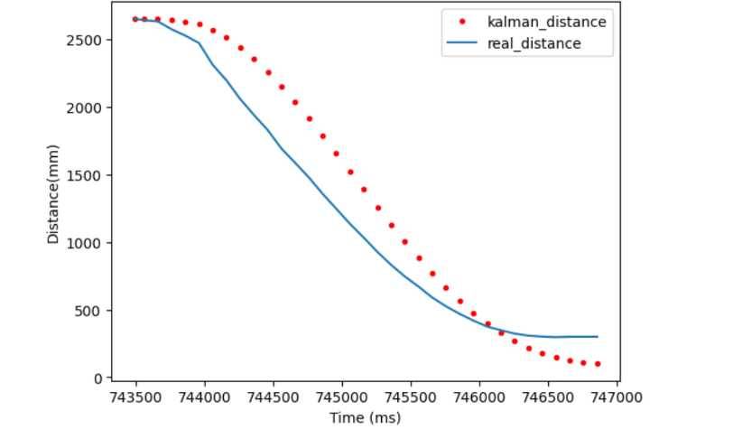
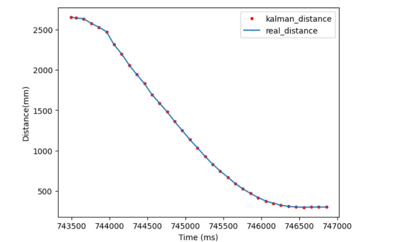
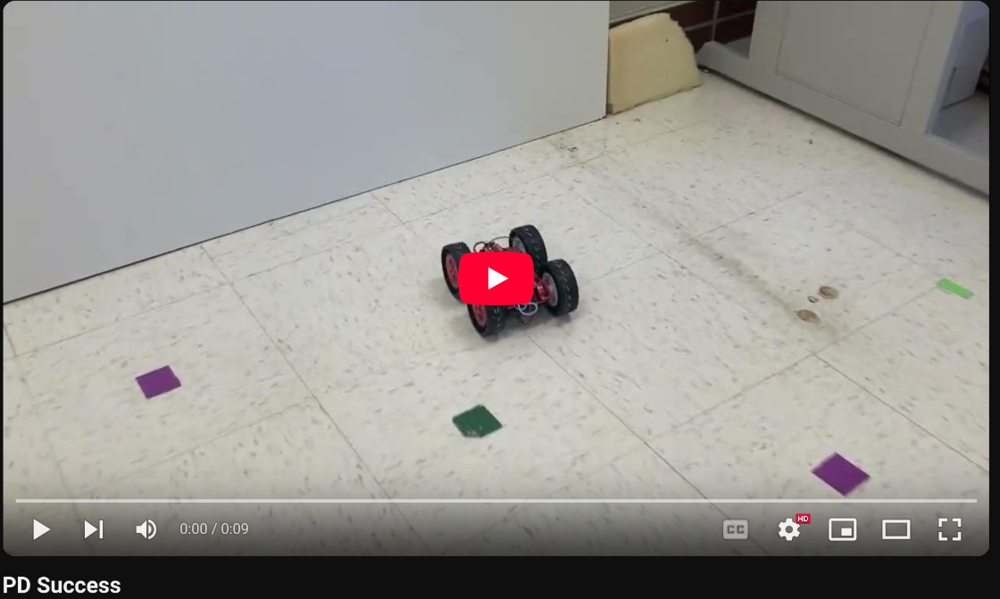
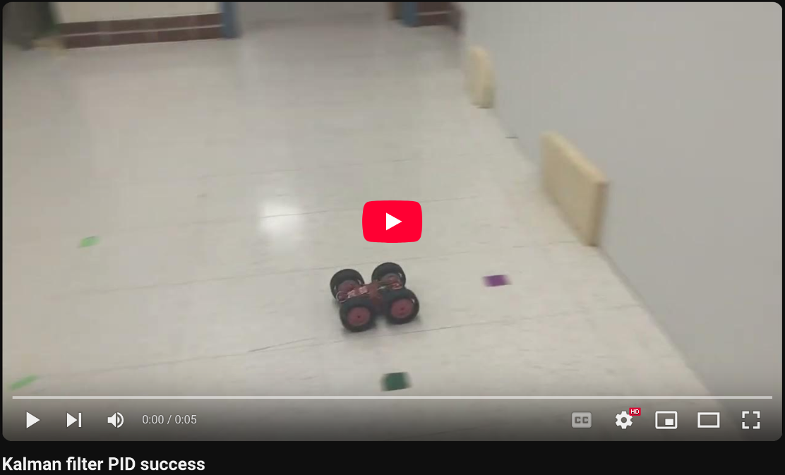
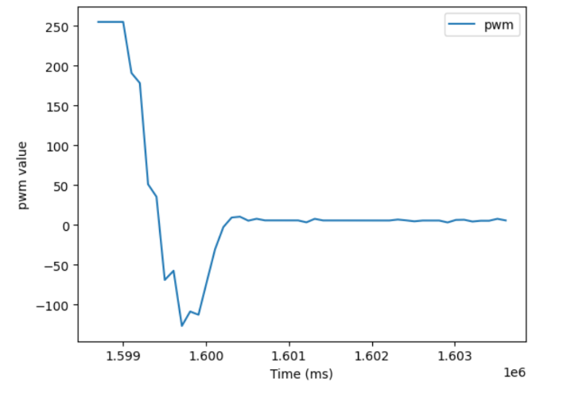
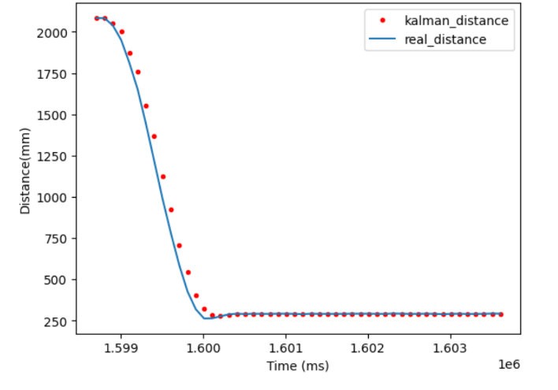

* [Main](index.md)

# Lab 7: Kalman Filter

In this lab we implemented a Kalman filter to imporve the performace of our PID control. This was needed because our ToF distance sensors are imperfect and have large uncertainties near the edges of their effective range, or when the distance is changing rapidly. The Kalman filter will allow our robot to execute the PID control implemented in Lab 5 faster.

## Estimating Drag and Momentum

The first step in implementing a Kalman filter is to build the state space model for the system. Our system's states were the distance from the wall (position), and velocity. Control was done through a PWM signal. The dynamics of the wheeled car driving on a surface with friction meant that I needed to estimate the drag and momentum of the car.



To do this, I created a new case that would drive the car at a wall for 5 seconds at the maximum owm value the motors could accept. This would allow the car to accelerate up to its maximum speed, or its "steady state". The robot would then send me the timestamped distance data so that I could calculate its velocity and estimate drag and momentum.

```C
case START_STEADY_STATE:
{
int i = 0;
int k = 0;
float pitch_g = 0, roll_g = 0, yaw_g = 0, dt =0, pitch_g_accum = 0, roll_g_accum = 0, yaw_g_accum = 0;
unsigned long last_time = millis();
unsigned long last_time1 = millis();
const float alpha = 0.2;
int distance1 = 0;
float currDist;
float error1;
float targetDist = 304;
float pwm;
float sumError;
float Pterm;
float Iterm;
float Dterm;
float old_error;
Serial.println("STARTING PID");
    //Build the Array
    unsigned long start_time = millis();
    while ( i < data_array_size && millis() - start_time < 5000) {
    if(distanceSensor1.checkForDataReady())
    {
        dt = (millis()-last_time1);
        last_time1 = millis();
        distance1 =  distanceSensor1.getDistance(); //Get the result of the measurement from the sensor
        distance_data1[i] = distance1;
        distanceSensor1.clearInterrupt();
        time_data[i] = millis();
        pwm = 255;
        if(pwm > 0)
        {
        if(pwm > maxSpeed)
            pwm = maxSpeed;
        }
        else if(pwm < 0)
        {
        if(pwm < -maxSpeed)
            pwm = -maxSpeed;
        }
        pwm_data[i] = pwm;
        if(pwm > 35){
        analogWrite(16,0);
        analogWrite(15,pwm);
        analogWrite(14,pwm*1.25);
        analogWrite(5,0);
        }
        else if(pwm < -35){
        // pwm = abs(pwm);
        analogWrite(16,abs(pwm));
        analogWrite(15,0);
        analogWrite(14,0);
        analogWrite(5,abs(pwm)*1.25);
        
        }
        else{
        analogWrite(16,0);
        analogWrite(15,0);
        analogWrite(14,0);
        analogWrite(5,0);
        }

        i++;
        // delay(1);
    

    }
        
    }
    analogWrite(16,0);
    analogWrite(15,0);
    analogWrite(14,0);
    analogWrite(5,0);

    for (int j = 0; j < i; j++) {

    if(time_data[j] == 0)
    break;

    tx_estring_value.clear();
    tx_estring_value.append(distance_data1[j]);
    tx_estring_value.append("|");
    tx_estring_value.append(time_data[j]);
    tx_characteristic_string.writeValue(tx_estring_value.c_str());

    }

    Serial.println("Sent time many times");
break;
}
```
Once the distance data was collected, I graphed both the distance data and the calculated velocity. The distance data clearly shows an acceleration up to max speed and then a linear region where speed is constant. unfortunately the calculated velocity seriously amplified the noise in the distance data, but if you squint you can see the velocity leveling off at around -3 mm/ms.



I calculated the average slope of the linear portion of the distance graph, and got a value of -3 mm/ms, which would be used to calculate drag.

```python 
xdot = 3000 #mm/s
d = 1/(xdot/1000)
```

I then eyeballed the velocity graph to get a time value of 1.25 seconds for the velocity to reach 90% of its max speed. This was used to calculate momemtum.
```python
t_r = 1250 #ms
m = (-d*t_r)/np.log(.1) #kg*m/s
```
I could then use these values to simulate running a kalman filter using my Lab 5 data.

## Simulation in Jupyter Notebook

Before attempting to run the kalman filter on the robot, I simulated running a kalman filter during the robot operation by running one on the saved data from lab5. This way I could verify my drag and momentum values without having to continuously crash my robot into a wall.

```python
#State Space
A = np.array([[0, 1], [0, -d/m]])
B = np.array([[0],[1/m]])#.T
C = np.array([[1,0]])

Delta_T = 0.100 #100ms
Ad = np.eye(2) + Delta_T * A  #n is the dimension of your state space 
Bd = Delta_T * B
Cd = C

sigma_1 = 31.6 #mm/s
sigma_2 = 31.6 #mm/s
sigma_3 = 20 #mm 
sig_u=np.array([[sigma_1**2,0],[0,sigma_2**2]]) #We assume uncorrelated noise, and therefore a diagonal matrix works.
sig_z=np.array([[sigma_3**2]])
```
The measurment noise was estimated to have a covariance of (20 mm)^2, and the process noise was calculated using the equation (100*1/(sampling rate))^.5, which gave a covariance of (31.6 mm/s)^2 when using the sampling rate of the ToF sensors, which was around 100 ms.

After the state space and covariances had been set up, I ran the following code on my Lab 5 data and graphed the results.

```python
def kf(mu, sigma, u, y):
    mu_p = Ad.dot(mu) + Bd.dot(u)
    sigma_p = Ad.dot(sigma.dot(Ad.transpose())) + sig_u
    sigma_m = Cd.dot(sigma_p.dot(C.transpose())) + sig_z

    kkf_gain = sigma_p.dot(Cd.transpose().dot(np.linalg.inv(sigma_m)))

    y_m = y-C.dot(mu_p)
    mu = mu_p + kkf_gain.dot(y_m)
    sigma = (np.eye(2) - kkf_gain.dot(C)).dot(sigma_p)
    return mu, sigma
```
```python
mu = np.array([[distance_data1_LAB5[0]],[0]])
sigma = np.array([[20**2, 0], [0, 10**2]])
mu_array = []
sigma_array = []
for i in range(101):
    mu, sigma = kf(mu, sigma, 1, distance_data1_LAB5[i])
    mu_array.append(mu)
    sigma_array.append(sigma)
```


The model used follws the measured distance sensors very closely, which gave me confidence that I had estimated the drag, momentum, and covariances accurately. 

To test this, I drastically increased my sensor noise covariance to 100, which the kalman filter would interpret as having unreliable data. This caused the filter to lag the measurements by quite a lot, which was the expected behavior, as if the model doesn't trust the measurments, it is slower to respond becuase any measuremtn may just be noise and not indicative of a trend in itself.



Conversely, if I set the sensor covariance to be too low, then the model follows the sensor data too closely, and doesn't smooth out the angles in the data cause by the noise, which the optimal model does.



Simulating on the data from lab5 gave me confidence to implement the Kalman Filter on my robot.

## Implementing the Kalman Filter on the physical Robot.

The filter implemented on the physical robot is simply a translation of the python filter into C. The PID controller from Lab 5 was then given the distance estimate of the filter instead of the ToF data.

```C
case START_PID_KALMAN:
{
int i = 0;
int k = 0;
unsigned long last_time = millis();
int distance1 = 0;
float currDist;
float error1;
float targetDist = 304;
float pwm;
float sumError;
float Pterm;
float Iterm;
float Dterm;
float old_error;

float xdot = 3000.0;
float d = 1/(xdot/1000.0);

float t_r = 1250.0;
float m = (-d*t_r)/log(.1);

Matrix<2,2> A = {0, 1,
        0, -1*d/m}; 
Matrix<2,1> B = {1, 1/m}; 
Matrix<1,2> C = {1,0}; 

float Delta_T = 0.100;
Matrix<2,2> I = {1, 0,
                    0, 1};
Matrix<2,2> Ad;
Ad  = I + Delta_T * A ;
Matrix<2,1> Bd;
Bd = Delta_T * B;
Matrix<1,2> Cd;
Cd = C;

float sigma_1 = 31.6;
float sigma_2 = 31.6;
float sigma_3 = 20;

Matrix<2,2> sig_u = {sigma_1*sigma_1, 0,
                        0, sigma_2*sigma_2};
Matrix<1> sig_z = {sigma_3*sigma_3};

Matrix<2,1> mu_p;
Matrix<2,2> sigma_p;
Matrix<1> sigma_m;

Matrix<2,1> kkf_gain;

Matrix<1> y_m;

Matrix<1> y;

Matrix<2,1> mu = {1,0};
Matrix<2,2> sigma = {20^2, 0, 
                0, 10^2};

Matrix<1> u = {1};
Serial.println("STARTING PID");
while (!distanceSensor1.checkForDataReady())
{
    delay(1);
}
distance1 =  distanceSensor1.getDistance();
distanceSensor1.clearInterrupt();
mu = {distance1, 0};
    //Build the Array
    
    unsigned long start_time = millis();
    while ( i < data_array_size && millis() - start_time < 10000) {
    if(distanceSensor1.checkForDataReady())
    {
        dt = (millis()-last_time);
        last_time = millis();
        distance1 =  distanceSensor1.getDistance(); //Get the result of the measurement from the sensor
        distance_data1[i] = distance1;
        distanceSensor1.clearInterrupt();
        time_data[i] = last_time;
        
        y = {distance1};

        mu_p = Ad*mu + Bd*u;
        
        sigma_p = Ad*sigma*~Ad + sig_u;
        
        sigma_m = Cd*sigma_p*~Cd + sig_z;
        
        kkf_gain = sigma_p*~Cd*Inverse(sigma_m);

        y_m = y-Cd*mu_p;
        mu = mu_p + kkf_gain*y_m;
        sigma = I - kkf_gain*Cd*sigma_p;

        mus[i] = mu(0);

        distance1 = mu(0);

        currDist = distance1;
        old_error = error;
        error = currDist-targetDist;
        //Proportional Control
        sumError = sumError + error*dt;
        Pterm = Kp * error;
        Iterm = Ki * sumError;
        Dterm = Kd * (error - old_error)/dt;
        pwm = Pterm + Iterm + Dterm;
        

        if(pwm > 0)
        {
        if(pwm > maxSpeed)
            pwm = maxSpeed;
        }
        else if(pwm < 0)
        {
        if(pwm < -maxSpeed)
            pwm = -maxSpeed;
        }
        pwm_data[i] = pwm;
        if(pwm > 35){
        analogWrite(16,0);
        analogWrite(15,pwm);
        analogWrite(14,pwm*1.25);
        analogWrite(5,0);
        }
        else if(pwm < -35){
        analogWrite(16,abs(pwm));
        analogWrite(15,0);
        analogWrite(14,0);
        analogWrite(5,abs(pwm)*1.25);
        
        }
        else{
        analogWrite(16,0);
        analogWrite(15,0);
        analogWrite(14,0);
        analogWrite(5,0);
        }

        i++;
    }
        
    }
    analogWrite(16,0);
    analogWrite(15,0);
    analogWrite(14,0);
    analogWrite(5,0);

    for (int j = 0; j < i; j++) {

    if(time_data[j] == 0)
    break;

    tx_estring_value.clear();
    tx_estring_value.append(distance_data1[j]);
    tx_estring_value.append("|");
        tx_estring_value.append(mus[j]);
    tx_estring_value.append("|");
    tx_estring_value.append(pwm_data[j]);
    tx_estring_value.append("|");
    tx_estring_value.append(time_data[j]);
    // tx_estring_value.append("|");
    // tx_estring_value.append(fast_time[j]);
    tx_characteristic_string.writeValue(tx_estring_value.c_str());

    }

    Serial.println("Sent time many times");
break;
}
```
Once this case was implemented, I re-tuned the robot so it could make the best use of the Kalman filter. Lab 5 used just a PD controller, with a Proportional gain of 0.05, and a Derivitive gain of 90. For reference, here is the speed of a successful run with this tuning:

[](https://youtu.be/-m6k3ABnfpQ)

The new tuning is now full PID control. Recal how in lab 5 increasing the proportional gain too much above around 0.05 caused the robot crashed into the wall. The Kalman filter allowed me to increase my Proportional gain to 0.20, as long as I also increasd my Derivitive gain just to 100. I added an Integral gain of 0.0000063 to correct for the small steady state error I got.

[](https://youtu.be/bJeBDWF2wZM)

The robot now drives full speed at the wall, stops at the last minute, and quickly corrects the small error without oscillating. 





## Discussion

I'm honestly really suprised the kalman filter improved the PID controller this much, as the filter isn't running any faster than the ToF sensors can collect data, which only happens every 100ms. I suspect I didn't do the best job tuning the robot in Lab 5, and now, with my improved knowledge of PID controlers, as well as the improvements of the Kalman filter reducing the uncertainty, I was able to get a very fast controller.