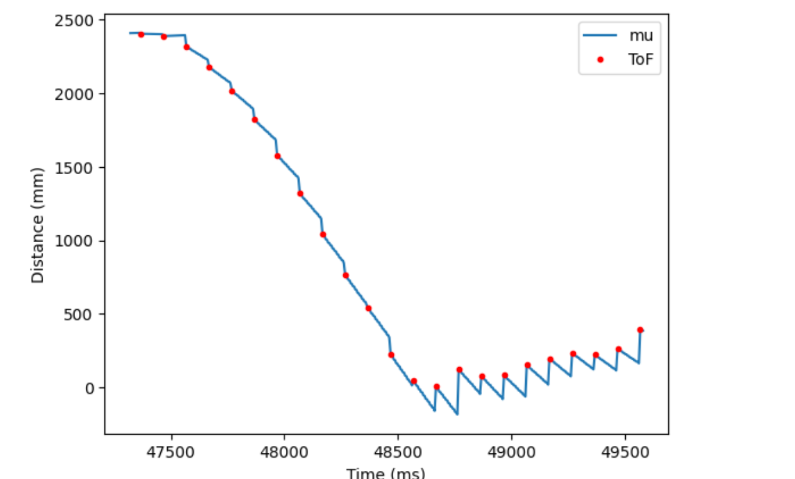

* [Main](index.md)

# Lab 8: Stunt!
This lab used a combination of skills learned in past labs in order to preform a stunt with the robot. The goal was the drive at the wall,change direction at the last momenent, and return to the starting zone as fast as possible. I chose to do this by making my robot flip end over end to change direction. 

# New Control Loop

The control needed to make the robot flip over was simply to change the direction of the motors at high speed. The robot would drive at the wall at its maximum speed, and then when it reached a certain point near the wall, the pwm values would be reversed so that the robot would now try to drive backwards. This sudden change in direction casues the robot to flip end over end due to the fact that the robot is front-heavy, and so the back of the robot gets lifted into the air and flips over the front. 

```C
if(distance1 < targetDist && FLIP_STATE == 0){
    FLIP_STATE++;
}
if (FLIP_STATE == 0){
    pwm = 255;
}else if(FLIP_STATE == 1){
    pwm = -255;
    u = {-1};
}


if(pwm > 0)
{
if(pwm > maxSpeed)
    pwm = maxSpeed;
}
else if(pwm < 0)
{
if(pwm < -maxSpeed)
    pwm = -maxSpeed;
}
pwm_data[i] = pwm;
if(pwm > 35){
    analogWrite(16,0);
    analogWrite(15,pwm);
    analogWrite(14,pwm*1.25);
    analogWrite(5,0);
}
else if(pwm < -35){
    analogWrite(16,abs(pwm));
    analogWrite(15,0);
    analogWrite(14,0);
    analogWrite(5,abs(pwm)*1.25);

}
else{
    analogWrite(16,0);
    analogWrite(15,0);
    analogWrite(14,0);
    analogWrite(5,0);
}

```

In order to run the control loop with an accurate position as fast as possible, I used a Kalman filter to estimate distance from the wall. This was set up in [Lab 7](lab7.md), but needed to be modified to have the prediction step run in between sensor measurements. Becuase this meant that the Kalman filter was running at a much higher frequency, the Delta_T value estimated in [Lab7](lab7.md) had to be recalculated. To account for changes in delta_T, I calculated the change in time since the last loop and re discretized my A, B and C matrices to account for it every loop. The predicted mu was used to determine if the car was within the target distance even if a sensor measurement did not come in. 

```C
if(distanceSensor1.checkForDataReady())
{
    time = millis()
    dt = (time-last_time1);
    dt = dt/1000;
    last_time1 = time;
    distance1 =  distanceSensor1.getDistance(); //Get the result of the measurement from the sensor
    distance_data1[k] = distance1;
    distanceSensor1.clearInterrupt();
    time_data[i] = last_time1;
    time_data_k[k] = last_time1;
    y = {distance1};

    Ad  = I + dt * A ;
    Bd = dt * B;
    Cd = C;

    mu_p = Ad*mu + Bd*u;
    
    sigma_p = Ad*sigma*~Ad + sig_u;
    
    sigma_m = Cd*sigma_p*~Cd + sig_z;
    
    kkf_gain = sigma_p*~Cd*Inverse(sigma_m);

    y_m = y-Cd*mu_p;
    mu = mu_p + kkf_gain*y_m;
    sigma = I - kkf_gain*Cd*sigma_p;

    mus[i] = mu(0);

    distance1 = mu(0);
} else{
    time = millis();
    time_data[i] = time;
    dt = (time-last_time1);
    last_time1 = time;
    dt = dt/1000;
    Ad  = I + dt * A ;
    Bd = dt * B;
    Cd = C;
    
    y = {distance1};

    mu_p = Ad*mu + Bd*u;
    
    sigma_p = Ad*sigma*~Ad + sig_u;
    
    // sigma_m = Cd*sigma_p*~Cd + sig_z;
    
    // kkf_gain = sigma_p*~Cd*Inverse(sigma_m);

    // y_m = y-Cd*mu_p;
    mu = mu_p;
    sigma = sigma_p;

    mus[i] = mu(0);

    distance1 = mu(0);
}
```

The data was then collected and sent to to jupyter lab over bluetooth in the same way it has been done in previous labs.

# Tuning

At first I set the Target distance to 304 mm, (about one foot), as this was the number I had used during PID control labs. This caused the robot to smash directly into the wall and crash. So I double the distance, and set it to 600 mm. This casued the robot to smash into the wall and then drive backwards. This was progress, so I doubled it again to get 1200 mm, and this was a success.

[](https://youtu.be/1S2klyXbdjo)

Graphing the data, we can see that the Kalman filter model might not have been estimated as accurately as I claimed in [Lab7](lab7.md), as there is a jump to each new ToF datapoint from where the filter is estimating. We can also see that this run managed to get a ToF sensor reading mid flip, presumably of the ceiling 5m away. The ToF sensor readings appear very flat when driving away from the wall, which I beleive means my ToF sensor is mounted facing slightly upwards, so that when my robot is upside down it measures a constant distace of the the floor some distance ahead of the robot.


# Victory Lap
 Now that I got a working flip, lets run it again.

[](https://youtu.be/2XCXkQ0lXK0)


One more time.

[](https://youtu.be/eGIUY7P8DnY)




The robot was able to go from a standstill at the starting line, flip at the wall, and return to the starting line in almost exactly 2 seconds.

# Blooper

While testing the flip, I got my robot to do this for no reason I could figure out or replicate.

[](https://youtu.be/8gZvURjv7Xo)