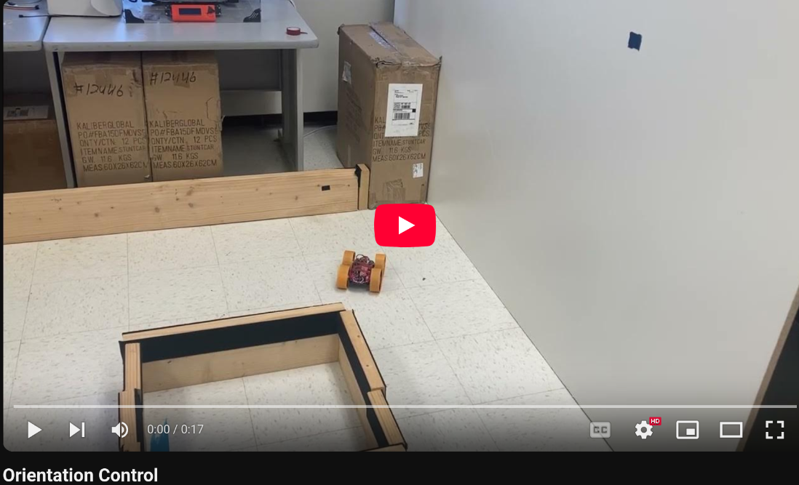
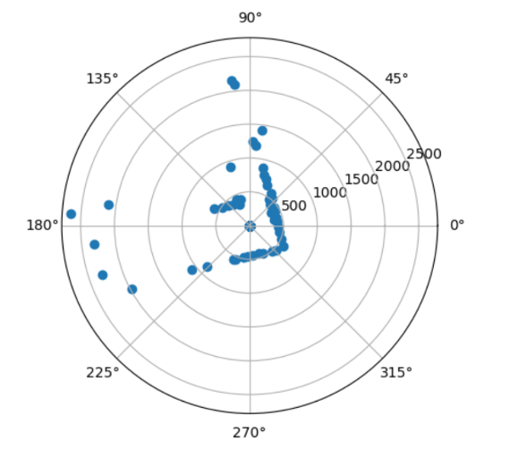

* [Main](index.md)

# Lab 9: Mapping

This lab involved using the robot's orientation control to take a 360 degree view of an area with the robot's distance sensors, and use the combined distance and orientation data to create a map.

# Orientation control

In order to get distance data from all around the robot, the robot needed to be able to spin around while staying in one place. There were multiple ways of doing this, and I tried multiple approaches before reaching a working conclution. I first attempted to use PID control with the robot's gyroscope data to ensure a smooth, slow turning speed. However, the robot's wheels proved too inconsistent to make this a viable option, as the same PID tuning could cause the robot to spin in multiple different ways. 

To get a more consistent preformance, I then implemented orientation control, which would turn the robot a set angle, stop, take a distance measurement, and then turn once more, repeating the pattern until 360 degrees had been covered. I was confident that this method would work, as I could re-use some of the code used in [Lab 6](lab6.md) to change the orientation.

When the PID_TURN case is called, the robot gets a new yaw value from the DMP (discussed in [Lab 6](lab6.md)). It then adds 10 degrees to this angle to set the new Target angle. It then enters the main loop which will run for 60 seconds, which was experiementally enough time for about 1 and a half rotations. It collects a distance measurement and a yaw measurement and stores them in specific arrays. These measurements will be used to create the map. It then enters a PID loop that will turn the robot 10 degrees to reach it's next target value. To ensure the robot doesn't get stuck waiting to get "close enough" to the target angle, the PID loop is run for 1 second, which I found to be enough time to make the turn. A new set of distance and yaw measurements are made for the map, 10 degrees are added to the target yaw, and the process repeats. After the 60 seconds have passed, the relevant data are sent over bluetooth to my computer for processing.

```C
case PID_TURN:
{
int i = 0;
int k = 0;
unsigned long last_time = millis();
double targetYaw = -1000;
double currYaw;
float dt = 0;
float error1;
float pwm;
float sumError;
float Pterm;
float Iterm;
float Dterm;
float old_error;
bool got_data;
int distance1 = 0;
for(int clean = 0; clean<data_array_size; clean++){
    map_yaw_data[clean] = 0;
    map_distance_data[clean] = 0;
}
icm_20948_DMP_data_t data;
//GET STARTING YAW VALUE
while(targetYaw == -1000){
    myICM.readDMPdataFromFIFO(&data);
    if((myICM.status == ICM_20948_Stat_Ok) || (myICM.status == ICM_20948_Stat_FIFOMoreDataAvail))
    {
    if ((data.header & DMP_header_bitmap_Quat6) > 0) // We have asked for GRV data so we should receive Quat6
    {
        double q1 = ((double)data.Quat6.Data.Q1) / 1073741824.0; // Convert to double. Divide by 2^30
        double q2 = ((double)data.Quat6.Data.Q2) / 1073741824.0; // Convert to double. Divide by 2^30
        double q3 = ((double)data.Quat6.Data.Q3) / 1073741824.0; // Convert to double. Divide by 2^30

        double q0 = sqrt(1.0 - ((q1 * q1) + (q2 * q2) + (q3 * q3)));

        double qw = q0;
        double qx = q2;
        double qy = q1;
        double qz = -q3;
        // yaw (z-axis rotation)
        double t3 = +2.0 * (qw * qz + qx * qy);
        double t4 = +1.0 - 2.0 * (qy * qy + qz * qz);
        double yaw = atan2(t3, t4) * 180.0 / PI;
        // if(yaw < 0){
        //   yaw = yaw + 360;
        // }
        targetYaw = yaw+10;;
        if(targetYaw > 180){
        targetYaw = -1*(180 - (targetYaw - 180));
        }
        if(targetYaw < -180){
        targetYaw = -1*(-180 - (targetYaw + 180));
        }
    }
    }
}

unsigned long start_time = millis();
//Loops through turns, stops after one minute
while(i < data_array_size && millis() - start_time < 60000){
    //stop robot
    analogWrite(16,0);
    analogWrite(15,0);
    analogWrite(14,0);
    analogWrite(5,0);
    //update target yaw
    targetYaw = targetYaw+10;;
    if(targetYaw > 180){
    targetYaw = -1*(180 - (targetYaw - 180));
    }
    if(targetYaw < -180){
    targetYaw = -1*(-180 - (targetYaw + 180));
    }
    //record distance data
    got_data = false;
    while(got_data == false){
    if(distanceSensor1.checkForDataReady())
    {
        distance1 = distanceSensor1.getDistance();
        distanceSensor1.clearInterrupt();
        map_distance_data[k] = distance1;
        got_data = true;
    }
    }
    //record yaw data
    got_data = false;
    while(got_data == false){
        myICM.readDMPdataFromFIFO(&data);
        if(((myICM.status == ICM_20948_Stat_Ok) || (myICM.status == ICM_20948_Stat_FIFOMoreDataAvail)))
        {
            if (((data.header & DMP_header_bitmap_Quat6) > 0) ) // We have asked for GRV data so we should receive Quat6
            {
                double q1 = ((double)data.Quat6.Data.Q1) / 1073741824.0; // Convert to double. Divide by 2^30
                double q2 = ((double)data.Quat6.Data.Q2) / 1073741824.0; // Convert to double. Divide by 2^30
                double q3 = ((double)data.Quat6.Data.Q3) / 1073741824.0; // Convert to double. Divide by 2^30

                double q0 = sqrt(1.0 - ((q1 * q1) + (q2 * q2) + (q3 * q3)));

                double qw = q0; 
                double qx = q2;
                double qy = q1;
                double qz = -q3;

                // yaw (z-axis rotation)
                double t3 = +2.0 * (qw * qz + qx * qy);
                double t4 = +1.0 - 2.0 * (qy * qy + qz * qz);
                double yaw = atan2(t3, t4) * 180.0 / PI;

                map_yaw_data[k] = yaw;
                
                k = k+1;
                got_data = true;
            }
        }
    }
    delay(100);
    unsigned long start_time_temp = millis();
    //PID TURN LOOP
    while(millis() - start_time_temp < 1000)
    {
    
    if ( i < data_array_size) {
        icm_20948_DMP_data_t data;
        myICM.readDMPdataFromFIFO(&data);
        if((myICM.status == ICM_20948_Stat_Ok) || (myICM.status == ICM_20948_Stat_FIFOMoreDataAvail))
        {
        if ((data.header & DMP_header_bitmap_Quat6) > 0) // We have asked for GRV data so we should receive Quat6
        {
            double q1 = ((double)data.Quat6.Data.Q1) / 1073741824.0; // Convert to double. Divide by 2^30
            double q2 = ((double)data.Quat6.Data.Q2) / 1073741824.0; // Convert to double. Divide by 2^30
            double q3 = ((double)data.Quat6.Data.Q3) / 1073741824.0; // Convert to double. Divide by 2^30

            double q0 = sqrt(1.0 - ((q1 * q1) + (q2 * q2) + (q3 * q3)));

            double qw = q0; // See issue #145 - thank you @Gord1
            double qx = q2;
            double qy = q1;
            double qz = -q3;

            // yaw (z-axis rotation)
            double t3 = +2.0 * (qw * qz + qx * qy);
            double t4 = +1.0 - 2.0 * (qy * qy + qz * qz);
            double yaw = atan2(t3, t4) * 180.0 / PI;
            // if(yaw < 0){
            //   yaw = yaw + 360;
            // }
            yaw_data[i] = yaw;
            time_data[i] = millis();
            i++;
            dt = (millis()-last_time);
            last_time = millis();
            currYaw = yaw;
            //_-360 depending on direction
            old_error = error1;
            error1 = currYaw-targetYaw;
            if (error1 > 180.0) {
                error1-= 360.0;
            } else if (error1 < -180.0) {
                error1 += 360.0;
            }
            pitch_data[i] = targetYaw;
            
            //PID Control
            sumError = sumError + error1*dt;
            Pterm = Kp * error1;
            Iterm = Ki * sumError;
            Dterm = Kd * (error1 - old_error)/dt;
            pwm = Pterm + Iterm + Dterm;
            if(pwm > 0)
            {
            if(pwm > maxSpeed)
                pwm = maxSpeed;
            }
            else if(pwm < 0)
            {
            if(pwm < -maxSpeed)
                pwm = -maxSpeed;
            }
            pwm_data[i] = pwm;
            if(pwm > 35){
                analogWrite(16,0);
                analogWrite(15,pwm*1.1);
                analogWrite(14,0);
                analogWrite(5,pwm*1);
            }
            else if(pwm < -35){
                analogWrite(16,abs(pwm)*1.1);
                analogWrite(15,0);
                analogWrite(14,abs(pwm)*1);
                analogWrite(5,0);
            
            }
            else{
            analogWrite(16,0);
            analogWrite(15,0);
            analogWrite(14,0);
            analogWrite(5,0);
            }
        }
        }
        if (myICM.status != ICM_20948_Stat_FIFOMoreDataAvail) // If more data is available then we should read it right away - and not delay
        {
        delay(10);
        }
        
    }
    }
}
analogWrite(16,0);
analogWrite(15,0);
analogWrite(14,0);
analogWrite(5,0);
for (int j = 0; j < i; j++) {

    if(time_data[j] == 0)
    break;

    tx_estring_value.clear();
    tx_estring_value.append(yaw_data[j]);
    tx_estring_value.append("|");
    tx_estring_value.append(time_data[j]);
    tx_estring_value.append("|");
    tx_estring_value.append(pwm_data[j]);
    tx_estring_value.append("|");
    tx_estring_value.append(map_distance_data[j]);
    tx_estring_value.append("|");
    tx_estring_value.append(map_yaw_data[j]);
    tx_characteristic_string.writeValue(tx_estring_value.c_str());

}
Serial.println("Sent time many times");
break;
}
```
In order to make it easier for my robot to make the small 10 degree turns, I covered the wheels with masking tape to reduce friction, and then retuned my PID control values from [Lab 6](lab6.md). 

[](https://youtu.be/83PK977OZJ0)

Plotting the Yaw, TargetAngle, and PWM signals, the robot does a fairly good job of following the target angle, albiet with occaisonal slippage. 


Once I had a robot that could turn at precise angles and gather yaw and distance data, I placed the robot at 4 spots in the map, (5,3), (0,3), (-3,-2), (5,-3). I then plotted the distance and yaw data on a polar graph to make sure that I was collecting data that made sense.

(5,3)


(0,3)


(-3,-2)


(5,-3)


# Data Collection

Encouraged by the sharp and defined corners in the polar plot, I then had to consollidate the data and plot it in cartesian coordinates. To do this, I needed rotation and translation matrices. The rotation matrix is needed to map the polar coordnates into cartisien coordinates, and the translation matrix moves the set of coordinates to be centered over where the robot's sensor actually was. 

Rotation Matrix:
```python
def rMatrix(Yaw):
    return np.array([[np.cos(Yaw), np.sin(Yaw)],
        [np.sin(Yaw), -np.cos(Yaw)]])
```
The coordinates where transformed into cartisian coordinates and then plotted:
```python
#(5,-3)
sensorPos = np.array([[-304 * 3], [304 * 5 + 75]])
transformed_5_n3 = []
for i in range(len(yaw_data_map_rad_5_n3)):
    rotationMatrix = rMatrix(yaw_data_map_rad_5_n3[i][0]+start_ang)
    dist = distance_data_map_5_n3[i][0]
    Point = np.matmul(rotationMatrix, np.array([[dist],[0]])) + sensorPos
    transformed_5_n3.append(Point)
# (5,3)
sensorPos = np.array([[304 * 3], [304 * 5 + 75]])
transformed_5_3 = []
for i in range(len(yaw_data_map_rad_5_3)):
    rotationMatrix = rMatrix(yaw_data_map_rad_5_3[i][0]+start_ang)
    dist = distance_data_map_5_3[i][0]
    Point = np.matmul(rotationMatrix, np.array([[dist],[0]])) + sensorPos
    transformed_5_3.append(Point)

# (0,3)
sensorPos = np.array([[304 * 3], [75]])
transformed_0_3 = []
for i in range(len(yaw_data_map_rad_0_3)):
    rotationMatrix = rMatrix(yaw_data_map_rad_0_3[i][0]+start_ang)
    dist = distance_data_map_0_3[i][0]
    Point = np.matmul(rotationMatrix, np.array([[dist],[0]])) + sensorPos
    transformed_0_3.append(Point)

# (-3,-2)
sensorPos = np.array([[-304 * 2], [-304 * 3 + 75]])
transformed_n3_n2 = []
for i in range(len(yaw_data_map_rad_0_n3)):
    rotationMatrix = rMatrix(yaw_data_map_rad_n3_n2[i][0]+start_ang)
    dist = distance_data_map_n3_n2[i][0]
    Point = np.matmul(rotationMatrix, np.array([[dist],[0]])) + sensorPos
    transformed_n3_n2.append(Point)
```
This was the result of my first mapping attempt:


Most of the sensor measurements are good, but it is obvious that the points collected at (5,3) are all at the wrong angle. This is because I the robot had disconnected between when I gathered that data and when I had gathered the rest of the data. The starting angle of the robot was different, which meant that I had to retake all of the datapoints again to ensure all had the same reference angle. For good measure, I added in a measurement taken at (0,0).


Not all of the groups of data appear to be at exactly the same angle, and so perhaps even with the DMP, there is still some drift that cannot be corrected for. However, the map is still clear from the points collected.

Adjusting the starting angle of the points collected at (0,0) and (-3,-2), which were the last two collected, creates an even better map;


# Convert to Line Map

Finally, I manually converted my distance measurements into a line map that could be used in future for localization. Aside from the angle issue discussed earlier, I would say the weakest oart if tge mao was the top part of the inner square, which was hard to see from either (5,3) or (0,3), and so has relatively few data points compared to the rest of the map. Still, it was enogh to make me confident in drawing a line accross it.

```python
# Outer Border
plt.plot([-1250, 1400], [2000, 2000], 'k', linewidth = 4)
plt.plot([-1250, -1250], [300, 2000], 'k', linewidth = 4)
plt.plot([-1250, -600], [300, 300], 'k', linewidth = 4)
plt.plot([-600, -600], [300, -150], 'k', linewidth = 4)
plt.plot([-600, -1250], [-150, -150], 'k', linewidth = 4)
plt.plot([-1250, -1250], [-1500, -150], 'k', linewidth = 4)
plt.plot([-1250, 100], [-1500, -1500], 'k', linewidth = 4)
plt.plot([100, 100], [-650, -1500], 'k', linewidth = 4)
plt.plot([100, 1400], [-650, -650], 'k', linewidth = 4)
plt.plot([1400, 1400], [-650, 2000], 'k', linewidth = 4)

# Inner Square
plt.plot([-200, 550], [700, 700], 'k', linewidth = 4)
plt.plot([-200, -200], [700, 1500], 'k', linewidth = 4)
plt.plot([-200, 550], [1500, 1500], 'k', linewidth = 4)
plt.plot([550, 550], [1500, 700], 'k', linewidth = 4)
plt.legend()
```


